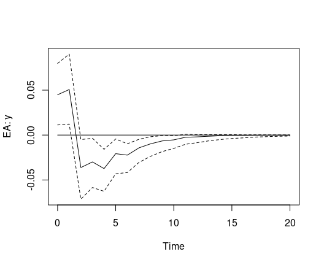

<!-- README.md is generated from README.Rmd. Please edit that file -->

# bgvars: Bayesian Inference for Global Vector Autoregressive (GVAR) and Global Vector Error Correction (GVEC) Models

[](https://cran.r-project.org/package=bgvars)
[](https://github.com/franzmohr/bgvars/actions)

## Overview

The `bgvars` package provides functions for the specification,
estimation and evaluation of Bayesian global autoregressive (GVAR)
models. Global vector autoregressive (GVAR) models are convenient tools
to model the world economy. They were originally proposed by Pesaran et
al. (2004) and further developed by Dees et al. (2007) to study the
international transmission of shocks. Since then they have been applied
to a range of macroeconomic topics. Chudik and Pesaran (2016) provide an
extensive survey of the latest developments in GVAR modelling.

## Installation

### Development version

``` r
# install.packages("devtools")
devtools::install_github("franzmohr/bgvars")
```

## Usage

The `bgvars` package allows Bayesian inference of GVAR models. It
separates a typical GVAR analysis into four steps:

- *Preparation*, which includes the initial transformation of raw data
  and the generation of regional aggregates as well as the weight
  matrices $W_{i, t}$;
- *Specification* for setting up country-specific models that should be
  estimated;
- *Estimation* using Bayesian algorithms to produce draws from the
  posterior distribution of each country model, which are subsequently
  combined to a global model;
- *Evaluation* for the generation of forecasts, impulse responses and
  forecast error variance decompositions.

### Data

The `bgvars` packages comes with the updated GVAR database of Mohaddes
and Raissi (2020), which contains economic time series for 33 countries
and 3 commodities from 1979Q2 to 2019Q4.[^1]

``` r
library(bgvars)
#> Loading required package: bvartools
#> Loading required package: coda
data("gvar2019")

country_data <- gvar2019$country_data # Country series
global_data <- gvar2019$global_data # Global commodities data
region_weights <- gvar2019$region_weights # Data for regional weights
weight_data <- gvar2019$weight_data # Data for trade weights

# Take first differences of non-stationary series  
country_data <- diff_variables(country_data, variables = c("y", "Dp", "r"), multi = 100)
global_data <- diff_variables(global_data, multi = 100)
```

### Preparation

Regional series can be calculated from individual country series with
the function `create_regions`.

``` r
# Generate EA area region with 3 year rolling window weights
ea <- c("AT", "BE", "DE", "ES", "FI", "FR", "IT", "NL")
temp <- create_regions(country_data = country_data,
                       regions = list("EA" = ea),
                       period = 3,
                       region_weights = region_weights,
                       weight_data = weight_data)

country_data <- temp$country_data
weight_data <- temp$weight_data
```

Weight matrices for each country/region can be calculated with the
function `create_weights`.

``` r
# Generate weight matrices as 3 year, rolling window averages
gvar_weights <- create_weights(weight_data = weight_data, period = 3,
                               country_data = country_data)
```

### Model specification

`bgvars` assists in the set-up country models by producing a list, where
each element contains all the information required to estimate a model.
First, the function `create_specifications` produces an object, which
contains the specifications for each country.

``` r
# Create an object with country model specifications
model_specs <- create_specifications(country_data = country_data,
                                     global_data = global_data,
                                     domestic = list(variables = c("y", "Dp", "r"), lags = 2),
                                     foreign = list(variables = c("y", "Dp", "r"), lags = 1),
                                     global = list(variables = c("poil"), lags = 1),
                                     deterministic = list(const = TRUE),
                                     countries = c("EA", "US", "JP", "CA", "GB", "CN"),
                                     iterations = 3000, burnin = 1000,
                                     type = "VAR")
```

Country specifications can be changed by accessing the elements of the
list directly:

``` r
model_specs$US$domestic$variables <- c("y", "Dp", "r")
model_specs$US$foreign$variables <- c("y", "Dp")
```

`create_models` produces all country models, which should be estimated.
This allows for easy parallelisation. The number of elements of the
resulting list depends on the specification of domestic lags, foreign
lags, global lags, and the rank of the cointegration matrix `r`, if
sepecified. For example, if the lags of domestic variables were set to
`lags = 1:2`, the function produces two country submodels for each
specification.

``` r
# Create estimable objects
object <- create_models(country_data = country_data,
                        weight_data = gvar_weights,
                        global_data = global_data,
                        model_specs = model_specs)
```

Finally, priors must be specified with `add_priors`.

``` r
object <- add_priors(object)
```

### Estimate and solve the model

`estimate_gvar` can be used to estimate the country models. Parallel
computating can be activated by specifying the argument `mc.cores`.

``` r
object <- draw_posterior(object)
```

The estimated country models can be combined and solved with the
function `combine_submodels`.

``` r
gvar <- combine_submodels(object)
```

### Impulse response analysis

Impulse response analysis can be done with the `girf` function.

``` r
gvar_irf <- girf(gvar, impulse = c("US", "r"),
                 response = c("EA", "y"),
                 n.ahead = 20, ci = .68)

plot(gvar_irf)
```



## References

Chudik, A. & Pesaran, M. H. (2016). Theory and practice of GVAR
modelling. *Journal of Economic Surveys 30*(1), 165-197.
<https://doi.org/10.1111/joes.12095>

Dees, S., Mauro, F., Pesaran, M. H., & Smith, V. L. (2007). Exploring
the international linkages of the euro area: A global VAR analysis.
*Journal of Applied Econometrics 22*(1), 1-38.
<https://doi.org/10.1002/jae.932>

George, E. I., Sun, D., & Ni, S. (2008). Bayesian stochastic search for
VAR model restrictions. *Journal of Econometrics, 142*(1), 553-580.
<https://doi.org/10.1016/j.jeconom.2007.08.017>

Koop, G., Pesaran, M. H., & Potter, S.M. (1996). Impulse response
analysis in nonlinear multivariate models. *Journal of Econometrics
74*(1), 119-147. <https://doi.org/10.1016/0304-4076(95)01753-4>

Lütkepohl, H. (2007). *New introduction to multiple time series
analysis* (2nd ed.). Berlin: Springer.

Mohaddes, K., & Raissi, M. (2020). Compilation, revision and updating of
the global VAR (GVAR) database, 1979Q2–2019Q4 (mimeo).
<https://www.mohaddes.org/gvar>.

Pesaran, H. H., & Shin, Y. (1998). Generalized impulse response analys
is in linear multivariate models. *Economics Letters, 58*(1), 17-29.
<https://doi.org/10.1016/S0165-1765(97)00214-0>

Pesaran, M., Schuermann, T., & Weiner, S. M. (2004). Modeling regional
interdependencies using a global error-correcting macroeconometric
model. *Journal of Business & Economic Statistics 22*(2), 129-162.
<https://doi.org/10.1198/073500104000000019>

[^1]: The paper and data set can be downloaded from
    <https://www.mohaddes.org/gvar>.
