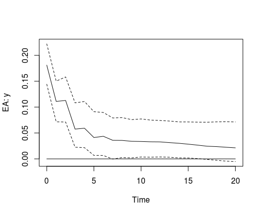

<!-- README.md is generated from README.Rmd. Please edit that file -->

# bgvars

[](https://cran.r-project.org/package=bgvars)
[](https://travis-ci.org/franzmohr/bgvars)

## Overview

The `bgvars` package provides functions for the specification,
estimation and evaluation of Bayesian global autoregressive (GVAR)
models. Global vector autoregressive (GVAR) models are convenient tools
to model the world economy. They were originally proposed by Pesaran et
al. (2004) and further developed by Dees et al. (2007) to study the
international transmission of shocks. Since then they have been applied
to a range of macroeconomic topics. Chudik and Pesaran (2016) provide an
extensive survey of the latest developments in GVAR modelling.

## Installation

### Development version

``` r
# install.packages("devtools")
devtools::install_github("franzmohr/bgvars")
```

## Usage

The `bgvars` package allows Bayesian inference of GVAR models. It
separates a typical GVAR analysis into four steps:

  - *Preparation*, which includes the initial transformation of raw data
    and the generation of regional aggregates as well as the weight
    matrices \(W_{i, t}\);
  - *Specification* for setting up country-specific models that should
    be estimated;
  - *Estimation* using Bayesian algorithms to produce draws from the
    posterior distribution of each country model, which are subsequently
    combined to a global model;
  - *Evaluation* for the generation of forecasts, impulse responses and
    forecast error variance decompositions.

### Data

The `bgvars` packages comes with the updated GVAR database of Mohaddes
and Raissi (2018), which contains economic time series for 33 countries
and 3 commodities from 1979Q2 to 2016Q4.\[1\]

``` r
library(bgvars)
data("gvar2016")

country_data <- lapply(gvar2016$country_data, function(x) {x * 100}) # Country series
global_data <- gvar2016$global_data * 100 # Global commodities data
region_weights <- gvar2016$region_weights # Data for regional weights
weight_data <- gvar2016$weight_data # Data for trade weights

# Take first differences of non-stationary series  
country_data <- diff_variables(country_data, variables = c("y", "eq", "ep"))
global_data <- diff_variables(global_data)
```

### Preparation

Regional series can be calculated from individual country series with
the function `create_regions`.

``` r
# Generate EA area region with 3 year rolling window weights
ea <- c("AT", "BE", "DE", "ES", "FI", "FR", "IT", "NL")
temp <- create_regions(country_data = country_data,
                       regions = list("EA" = ea),
                       period = 3,
                       region_weights = region_weights,
                       weight_data = weight_data)

country_data <- temp$country_data
weight_data <- temp$weight_data
```

Weight matrices for each country/region can be calculated with the
function `create_weights`.

``` r
# Generate weight matrices as 3 year, rolling window averages
gvar_weights <- create_weights(weight_data = weight_data, period = 3,
                               country_data = country_data)
```

### Model specification

`bgvars` assists in the set-up country models by producing a list, where
each element contains all the information required to estimate a model.
First, the function `create_specifications` produces an object, which
contains the specifications for each country.

``` r
# Create an object with country model specifications
model_specs <- create_specifications(country_data = country_data,
                                     global_data = global_data,
                                     variables = c("y", "Dp", "r", "poil"),
                                     countries = c("EA", "US", "JP", "CA", "GB", "CN"),
                                     p_domestic = 2,
                                     p_foreign = 1,
                                     type = "VAR")
```

Country specifications can be changed by accessing the elements of the
list directly:

``` r
model_specs$US$domestic$variables <- c("y", "Dp", "r")
model_specs$US$foreign$variables <- c("y", "Dp")
```

`create_models` produces all country models, which should be estimated.
This allows for easy parallelisation. The number of elements of the
resulting list depends on the specification of domestic lags
`p_domestic`, foreign lags `p_foreign`, lags of global lags `s`, and the
rank of the cointegration matrix `r`, if sepecified. For example, if
`p_domestic = 1:2` was set in `create_specifications`, the function
produces two elements for each country in the resulting list.

``` r
# Create estimable objects
object <- create_models(country_data = country_data,
                        gvar_weights = gvar_weights,
                        global_data = global_data,
                        model_specs = model_specs)
```

Additional elmements can be added by using `add_` functions. A standard
addition would be deterministic terms:

``` r
# Add deterministic terms
object <- add_deterministics(object, const = TRUE)
```

It is also possible to estimated the models using the SSVS algorithm of
George et al. (2008) or the BVS algorithm of Korobilis (2013) by using
`add_ssvs` and `add_bvs`, respectively.

Finally, priors must be specified with `add_priors`.

``` r
object <- add_priors(object)
```

### Estimate and solve the model

`estimate_gvar` can be used to estimate the country models. Parallel
computating can be activated by specifying the argument
`mc.cores`.

``` r
object <- estimate_gvar(object, iterations = 5000, burnin = 1000, thin = 5)
#> Estimating country models.
```

The estimated country models can be combined and solved with the
function `solve_gvar`.

``` r
gvar <- solve_gvar(object)
#> Solving GVAR model.
```

### Impulse response analysis

Impulse response analysis can be done with the `girf` function.

``` r
gvar_irf <- girf(gvar, impulse = c("US", "y"),
                 response = c("EA", "y"),
                 n.ahead = 20, ci = .68)

plot(gvar_irf)
```



## References

Chudik, A. & Pesaran, M. H. (2016). Theory and practice of GVAR
modelling. *Journal of Economic Surveys 30*(1), 165-197.
<https://doi.org/10.1111/joes.12095>

Dees, S., Mauro, F., Pesaran, M. H., & Smith, V. L. (2007). Exploring
the international linkages of the euro area: A global VAR analysis.
*Journal of Applied Econometrics 22*(1), 1-38.
<https://doi.org/10.1002/jae.932>

George, E. I., Sun, D., & Ni, S. (2008). Bayesian stochastic search for
VAR model restrictions. *Journal of Econometrics, 142*(1), 553-580.
<https://doi.org/10.1016/j.jeconom.2007.08.017>

Koop, G., Pesaran, M. H., & Potter, S.M. (1996). Impulse response
analysis in nonlinear multivariate models. *Journal of Econometrics
74*(1), 119-147. <https://doi.org/10.1016/0304-4076(95)01753-4>

Lütkepohl, H. (2007). *New introduction to multiple time series
analysis* (2nd ed.). Berlin: Springer.

Mohaddes, K., & Raissi, M. (2018). Compilation, revision and updating of
the global VAR (GVAR) database, 1979Q2–2016Q4 (mimeo).
<https://www.mohaddes.org/gvar>.

Pesaran, H. H., & Shin, Y. (1998). Generalized impulse response analys
is in linear multivariate models. *Economics Letters, 58*(1), 17-29.
<https://doi.org/10.1016/S0165-1765(97)00214-0>

Pesaran, M., Schuermann, T., & Weiner, S. M. (2004). Modeling regional
interdependencies using a global error-correcting macroeconometric
model. *Journal of Business & Economic Statistics 22*(2), 129-162.
<https://doi.org/10.1198/073500104000000019>

1.  The paper and dataset can be downloaded from
    <https://www.mohaddes.org/gvar>.
