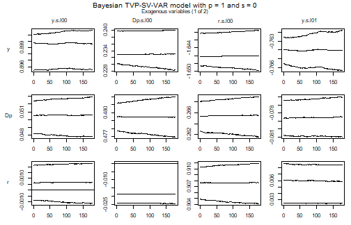
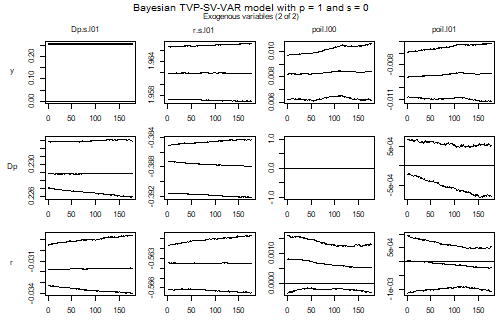
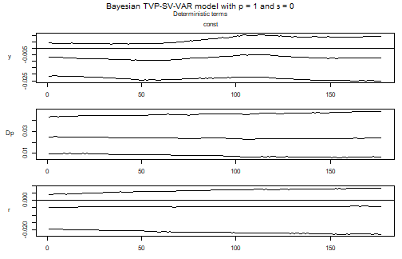
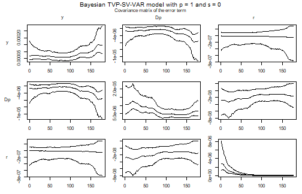

## Introduction

A GVAR sub-model is a VARX\* model: the endogenous variables of one country,
its weakly exogenous foreign variables, and the global variables. `bgvars`
hands that model to the samplers of `bvartools`, so the arguments that make a
VAR time varying make a sub-model time varying in the same way. `tvp = TRUE`
turns the coefficients into random walks, `error = "sv+covar"` turns the error
covariance matrix into a stochastic volatility process, and `varsel = "bvs"`
adds Bayesian variable selection after Korobilis (2013).

The vignette on time varying parameters and stochastic volatility in
`bvartools` sets out the model equations and what each prior does. This one
covers what is specific to a global model: how the specification is applied to
every sub-model at once, what the sub-models look like afterwards, and -- at
the end -- where the road currently stops, because a global model cannot yet be
solved from time varying or stochastic volatility sub-models.

The reason for wanting these models on this data set is the sample. It runs to
2023Q3 and therefore contains the global financial crisis and the pandemic, two
episodes in which the size of the shocks that hit real GDP is nothing like the
size of the shocks in the surrounding decades. A sub-model with a constant error
covariance matrix has to average over that.

## Data


``` r
library(bgvars)

data("gvar2023")

global_data <- gvar2023[["global_data"]][, "poil", drop = FALSE]
submodel_data <- select_list_elements(gvar2023[["submodel_data"]],
                                      c("AT", "DE", "US"))
```

Three countries keep the example small. The specification below uses output,
inflation and the short-term interest rate, and leaves the exchange rate out.
That is not only for brevity: the deflated exchange rate `ep` of the US model in
this data set is minus the US price level by construction, so its innovation is
minus the innovation of US inflation, and a US sub-model that contains both has
an exactly singular error covariance matrix. The GVAR literature handles this by
giving the US model a specification of its own, which the vignette on global
vector autoregressive models shows how to do.

## Model set-up


``` r
object <- create_gvarmodel(submodel_data = submodel_data,
                           global_data = global_data)

object <- add_weight_matrices(object,
                              submodel_data = submodel_data,
                              period = 3)
```

`add_submodels` applies one specification to every sub-model, and the time
varying arguments are part of it.


``` r
object <- add_submodels(object,
                        endogen = c("y", "Dp", "r"),
                        p_endogen = 1,
                        exogen = c("y", "Dp", "r"),
                        p_exogen = 1,
                        global = "poil",
                        s = 1,
                        tvp = TRUE,
                        error = "sv+covar",
                        varsel = "bvs",
                        iterations = 2000,
                        burnin = 1000)

object <- align_model_obs(object)

object[["submodels"]][["AT"]][[1]][["model"]][["algorithm"]]
#> [1] "VarTvpStochvol"
```

Every sub-model is estimated by the same sampler, and each gets its own state
equations: its own variances of the coefficient random walks, its own
log-volatilities, and its own inclusion parameters. Nothing about the time
varying part is shared across countries. What ties the sub-models together are
the weight matrices, which turn the endogenous variables of the global model
into the weakly exogenous variables of each sub-model, and those are the same
whether a sub-model is time varying or not.

## Priors, initial values and posterior draws

The prior lists are the ones of the `bvartools` vignette and are passed
unchanged to every sub-model. One value differs, and it is the most important
choice in this vignette.


``` r
object <- add_priors(object,
                     coef = list(v_i = 1, v_i_det = 1 / 10,
                                 shape = 3, rate = 1e-8, rate_det = 1e-6),
                     sigma = list(shape = 3, rate = 0.01,
                                  mu = 0, v_i = 0.01,
                                  state_variance = 0.05, offset = 1e-8),
                     varsel = list(inprior = 0.5, exclude_det = TRUE))

object <- add_initial_values(object)
```

`coef$rate` is the rate of the inverse gamma prior of the variances of the
random walks of the coefficients, and it decides how far a coefficient may move
from one quarter to the next. It is not scale free. The value of `0.0001` that
the `bvartools` vignette uses on series measured in percent is far too loose
here, because the variables of this data set are logarithms, whose regressors
are of order one while the residuals are of order one percent.

The consequence is worth stating plainly, because the model does not complain.
Each of these sub-models has 24 coefficients per period against three
observations per period, so it is saturated: given enough freedom the
coefficient path fits every observation exactly, the residuals collapse to
zero, and the volatility process is left with nothing to explain. At
`coef$rate = 0.0001` that is what happens -- the fitted residuals of the output
equation have a standard deviation of 0.0004 against 0.012 for the same
regression estimated by least squares, and the estimated volatility is a flat
line. At `1e-8` the coefficients still move, the fit is a little better than
least squares rather than perfect, and the volatilities do the work they are
there for.

The check is worth running on any time varying model with many coefficients and
a short sample: compare the residuals under the posterior mean of the
coefficient path with the residuals of an ordinary least squares fit of the same
regressors. If the first is very much smaller than the second, the coefficients
have absorbed the model.


``` r
object <- add_posterior_coefficients(object)
```

Sub-models are independent of one another given the weight matrices, so this
step parallelises over them, and the cost of the time varying specification is
paid once per country.

## Evaluation

A sub-model is an ordinary model object, so everything the `bvartools` vignette
does with a TVP-SV-VAR applies to it.


``` r
model_at <- object[["submodels"]][["AT"]][[1]]

summary(model_at)
#> 
#> Bayesian TVP-SV-VAR model with p = 1 and s = 0 
#> 
#> Variable selection algorithm: Bayesian variable selection (Korobilis, 2013)
#> 
#> Endogenous variables: y, Dp, r
#> 
#> Period: 177 
#> 
#> Variable: y 
#> 
#>                  Mean          SD     Naive SD Time-series SD         2.5%
#> y.l1      0.867278255 0.001552768 3.472095e-05   0.0006855849  0.864275119
#> Dp.l1    -0.078967568 0.063327569 1.416047e-03   0.0040914490 -0.133896213
#> r.l1     -0.756831049 0.002222876 4.970502e-05   0.0011464371 -0.760803992
#> y.s.l00   0.899396523 0.001486495 3.323903e-05   0.0004810731  0.895550672
#> Dp.s.l00  0.228942726 0.033673957 7.529726e-04   0.0021684414  0.228376519
#> r.s.l00  -1.645343134 0.002761909 6.175816e-05   0.0015507387 -1.649769586
#> y.s.l01  -0.764050569 0.001148686 2.568540e-05   0.0003181641 -0.766321243
#> Dp.s.l01  0.247258498 0.041616464 9.305724e-04   0.0026025956  0.000000000
#> r.s.l01   1.962187737 0.002667344 5.964363e-05   0.0014772594  1.956882701
#> poil.l00  0.008384948 0.001134424 2.536649e-05   0.0002453188  0.006127611
#> poil.l01 -0.008718917 0.001312803 2.935516e-05   0.0004939338 -0.011168765
#> const    -0.007540555 0.009414531 2.105153e-04   0.0039468162 -0.025110520
#>                   50%        97.5% Incl. prob.  
#> y.l1      0.867352246  0.869897894      1.0000 *
#> Dp.l1    -0.126930161  0.000000000      0.6090  
#> r.l1     -0.756661359 -0.753066923      1.0000 *
#> y.s.l00   0.899601882  0.901742361      1.0000 *
#> Dp.s.l00  0.233046742  0.240027833      0.9790 *
#> r.s.l00  -1.646017764 -1.639498366      1.0000 *
#> y.s.l01  -0.764041046 -0.761765351      1.0000 *
#> Dp.s.l01  0.254058576  0.257742753      0.9725  
#> r.s.l01   1.961959543  1.967312482      1.0000 *
#> poil.l00  0.008402304  0.010619317      1.0000 *
#> poil.l01 -0.008780965 -0.006190417      1.0000 *
#> const    -0.007286112  0.009203288      1.0000  
#> 
#> Variable: Dp 
#> 
#>                   Mean           SD     Naive SD Time-series SD          2.5%
#> y.l1      2.293166e-02 0.0021617293 4.833774e-05   1.375446e-03  0.0200289830
#> Dp.l1     2.664777e-01 0.0027054332 6.049533e-05   2.463494e-03  0.2620030083
#> r.l1      2.740040e-03 0.0030890989 6.907435e-05   1.540824e-03 -0.0016695513
#> y.s.l00   5.049617e-02 0.0013783534 3.082092e-05   7.093975e-04  0.0478338571
#> Dp.s.l00  4.794161e-01 0.0012945238 2.894643e-05   3.589753e-04  0.4769332366
#> r.s.l00   2.654924e-01 0.0019350989 4.327013e-05   7.306491e-04  0.2615571798
#> y.s.l01  -7.847367e-02 0.0012826083 2.867999e-05   4.659983e-04 -0.0809669044
#> Dp.s.l01  2.291709e-01 0.0019408023 4.339766e-05   6.760580e-04  0.2260069711
#> r.s.l01  -3.882128e-01 0.0023501526 5.255101e-05   1.595334e-03 -0.3920492677
#> poil.l00  0.000000e+00 0.0000000000 0.000000e+00   0.000000e+00  0.0000000000
#> poil.l01 -1.799557e-05 0.0002743476 6.134598e-06   2.959397e-05 -0.0007761151
#> const     2.508707e-02 0.0117927036 2.636929e-04   7.291518e-03  0.0066367109
#>                   50%         97.5% Incl. prob.  
#> y.l1      0.022275684  0.0274990923      1.0000 *
#> Dp.l1     0.266398861  0.2710438054      1.0000 *
#> r.l1      0.002214562  0.0085149310      0.9310  
#> y.s.l00   0.050594816  0.0529047394      1.0000 *
#> Dp.s.l00  0.479410478  0.4819855118      1.0000 *
#> r.s.l00   0.265517527  0.2689116999      1.0000 *
#> y.s.l01  -0.078469950 -0.0760361495      1.0000 *
#> Dp.s.l01  0.228873134  0.2329095923      1.0000 *
#> r.s.l01  -0.387942484 -0.3843361978      1.0000 *
#> poil.l00  0.000000000  0.0000000000      0.0000  
#> poil.l01  0.000000000  0.0005215473      0.1595  
#> const     0.023717182  0.0476364777      1.0000 *
#> 
#> Variable: r 
#> 
#>                   Mean           SD     Naive SD Time-series SD          2.5%
#> y.l1     -0.0051113931 0.0006349776 1.419853e-05   1.682022e-04 -0.0063399337
#> Dp.l1     0.0508662152 0.0015490958 3.463883e-05   5.481135e-04  0.0473015433
#> r.l1      0.6420327193 0.0019077444 4.265846e-05   6.249545e-04  0.6386860144
#> y.s.l00   0.0006098338 0.0009532330 2.131494e-05   5.745360e-04 -0.0011372092
#> Dp.s.l00 -0.0138330072 0.0091897486 2.054890e-04   5.780397e-03 -0.0243645579
#> r.s.l00   0.9075482953 0.0018928958 4.232644e-05   7.449440e-04  0.9041397621
#> y.s.l01   0.0055172045 0.0018171998 4.063382e-05   1.228541e-03  0.0023883418
#> Dp.s.l01 -0.0315608549 0.0014118133 3.156911e-05   5.536328e-04 -0.0339329360
#> r.s.l01  -0.5635400476 0.0015195318 3.397776e-05   3.890744e-04 -0.5664986358
#> poil.l00  0.0005281058 0.0004142818 9.263623e-06   9.873974e-05 -0.0002824996
#> poil.l01 -0.0002426429 0.0004108955 9.187903e-06   6.204609e-05 -0.0010877234
#> const    -0.0061443540 0.0099628693 2.227765e-04   7.803769e-03 -0.0233950306
#>                    50%         97.5% Incl. prob.  
#> y.l1     -0.0051161410 -0.0038704679       1.000 *
#> Dp.l1     0.0510440250  0.0534026055       1.000 *
#> r.l1      0.6418939496  0.6459184636       1.000 *
#> y.s.l00   0.0006444178  0.0022881249       1.000  
#> Dp.s.l00 -0.0185318336  0.0000000000       0.703  
#> r.s.l00   0.9076641779  0.9109178669       1.000 *
#> y.s.l01   0.0058680082  0.0084541259       1.000 *
#> Dp.s.l01 -0.0316416571 -0.0286389223       1.000 *
#> r.s.l01  -0.5634936625 -0.5606886322       1.000 *
#> poil.l00  0.0005440371  0.0013245150       1.000  
#> poil.l01 -0.0002230970  0.0005325147       1.000  
#> const    -0.0041144805  0.0086931216       1.000  
#> 
#> Variance-covariance matrix:
#> 
#>                Mean           SD     Naive SD Time-series SD          2.5%
#> y_y    1.556130e-04 5.501086e-05 1.230080e-06   2.455956e-06  8.429618e-05
#> y_Dp  -6.040982e-06 2.156867e-06 4.822901e-08   1.036693e-07 -1.113045e-05
#> y_r   -1.237460e-07 2.797707e-07 6.255863e-09   1.099094e-07 -7.619464e-07
#> Dp_Dp  6.989105e-06 2.515685e-06 5.625242e-08   1.478531e-07  3.542882e-06
#> Dp_r  -1.400725e-08 1.803267e-08 4.032227e-10   0.000000e+00 -4.810438e-08
#> r_r    6.369423e-08 3.713594e-08 8.303848e-10   2.321894e-09  1.914147e-08
#>                 50%         97.5%  
#> y_y    1.449801e-04  2.865439e-04 *
#> y_Dp  -5.604169e-06 -3.210944e-06 *
#> y_r   -6.422068e-08  2.778608e-07  
#> Dp_Dp  6.543142e-06  1.286979e-05 *
#> Dp_r  -1.511548e-08  2.093157e-08  
#> r_r    5.541666e-08  1.636771e-07 *
```

The table describes the last period of the estimation sample; argument `period`
asks for another one. The regressors ending in `.s` are the weakly exogenous
foreign variables that the weight matrices produced.

### Volatility across countries

The figure that justifies the specification is the volatility of the output
equation, which the following extracts for each sub-model in turn.


``` r
volatility <- function(object, variable) {
  k <- object[["model"]][["k"]]
  kk <- k * k
  tt <- nrow(object[["data"]][["train"]][["y"]])
  draws <- object[["posterior"]][["u_sigma_inv"]][["coeffs"]]
  i <- which(object[["model"]][["endogen"]] == variable)

  result <- rep(NA_real_, tt)
  for (period in 1:tt) {
    result[period] <- mean(apply(draws[, (period - 1) * kk + 1:kk], 1,
                                 function(x, k, i) {
                                   sqrt(solve(matrix(x, k))[i, i])
                                 }, k = k, i = i))
  }

  stats::ts(result, start = stats::start(object[["data"]][["train"]][["y"]]),
            frequency = stats::frequency(object[["data"]][["train"]][["y"]]))
}

paths <- sapply(object[["submodels"]], function(x) {volatility(x[[1]], "y")})
paths <- stats::ts(paths,
                   start = stats::start(model_at[["data"]][["train"]][["y"]]),
                   frequency = 4)

plot(paths, main = "Volatility of the output equation")
```

<div class="figure" style="text-align: center">

<p class="caption">plot of chunk volatility</p>
</div>

Each country gets its own path. This is what a constant error covariance matrix
cannot represent: it would have to choose a single number for a sample in which
the size of an output shock differs by a large factor between the quiet years
and 2020.

The residual check of the previous section belongs beside this figure, since the
two are the same question asked twice. A volatility path that is a flat line is
rarely a finding about the data; it usually means the coefficients were allowed
to move enough to leave no residual behind.


``` r
residual_sd <- function(object) {
  k <- object[["model"]][["k"]]
  m <- ncol(object[["data"]][["train"]][["z"]])
  tt <- nrow(object[["data"]][["train"]][["y"]])
  y <- matrix(t(object[["data"]][["train"]][["y"]]))
  z <- object[["data"]][["train"]][["z"]]

  a <- colMeans(object[["posterior"]][["a"]][["coeffs"]])
  fitted <- rep(NA_real_, tt * k)
  for (period in 1:tt) {
    rows <- (period - 1) * k + 1:k
    fitted[rows] <- z[rows, ] %*% a[(period - 1) * m + 1:m]
  }

  ols <- solve(crossprod(z)) %*% crossprod(z, y)

  result <- rbind(apply(matrix(y - fitted, k), 1, stats::sd),
                  apply(matrix(y - z %*% ols, k), 1, stats::sd))
  dimnames(result) <- list(c("tvp", "ls"), object[["model"]][["endogen"]])
  result
}

round(residual_sd(model_at), 5)
#>           y      Dp       r
#> tvp 0.00890 0.00257 0.00061
#> ls  0.00929 0.00276 0.00072
```

### Coefficient paths


``` r
plot(model_at)
```

<div class="figure" style="text-align: center">

<p class="caption">plot of chunk paths</p>
</div><div class="figure" style="text-align: center">

<p class="caption">plot of chunk paths</p>
</div><div class="figure" style="text-align: center">

<p class="caption">plot of chunk paths</p>
</div><div class="figure" style="text-align: center">

<p class="caption">plot of chunk paths</p>
</div><div class="figure" style="text-align: center">

<p class="caption">plot of chunk paths</p>
</div>

`plot` draws one figure per block of coefficients rather than one figure for the
whole model, which for a sub-model of this size is the difference between panels
that can be read and panels that cannot. A panel resting on a flat line at zero
is a coefficient that variable selection switched off. Since one inclusion parameter is drawn per coefficient rather than
per coefficient and period, a regressor is either in a sub-model over the whole
sample or out of it over the whole sample, and the inclusion probabilities
therefore differ across countries but not across periods.

The coefficient paths of this specification drift slowly and by small amounts,
and the columns of $\Sigma_t$ beside them do not. That is the other side of the
prior discussed above and it is worth reading as a result rather than as a
disappointment: for these series most of what changes over four decades is the
size of the shocks, not the transmission, which is the usual finding for
macroeconomic data and the reason the constant coefficient model with stochastic
volatility is hard to beat.


``` r
inclusion <- function(object) {
  k <- object[["model"]][["k"]]
  matrix(round(colMeans(object[["posterior"]][["a"]][["lambda"]]), 2), k,
         dimnames = list(object[["model"]][["endogen"]],
                         dimnames(object[["data"]][["train"]][["x"]])[[2]]))
}

lapply(object[["submodels"]], function(x) {inclusion(x[[1]])})
#> $AT
#>    y.01 Dp.01 r.01 y.s.l00 Dp.s.l00 r.s.l00 y.s.l01 Dp.s.l01 r.s.l01 poil.l00
#> y     1  0.61 1.00       1     0.98       1       1     0.97       1        1
#> Dp    1  1.00 0.93       1     1.00       1       1     1.00       1        0
#> r     1  1.00 1.00       1     0.70       1       1     1.00       1        1
#>    poil.l01 const
#> y      1.00     1
#> Dp     0.16     1
#> r      1.00     1
#> 
#> $DE
#>    y.01 Dp.01 r.01 y.s.l00 Dp.s.l00 r.s.l00 y.s.l01 Dp.s.l01 r.s.l01 poil.l00
#> y     1  0.95 0.74       1     0.93    0.44       1     0.85     1.0     0.74
#> Dp    1  1.00 1.00       1     1.00    0.87       1     0.47     0.8     1.00
#> r     1  0.95 1.00       1     1.00    1.00       1     0.95     1.0     1.00
#>    poil.l01 const
#> y      0.35     1
#> Dp     1.00     1
#> r      1.00     1
#> 
#> $US
#>    y.01 Dp.01 r.01 y.s.l00 Dp.s.l00 r.s.l00 y.s.l01 Dp.s.l01 r.s.l01 poil.l00
#> y     1  1.00 0.88       1        1       1       1     0.88    0.72     0.96
#> Dp    1  1.00 0.67       1        1       1       1     0.89    1.00     1.00
#> r     1  0.88 1.00       1        1       1       1     0.00    1.00     1.00
#>    poil.l01 const
#> y         1     1
#> Dp        1     1
#> r         1     1
```

### Impulse responses of a sub-model


``` r
period_of <- function(object, year, quarter) {
  which(stats::time(object[["data"]][["train"]][["y"]]) == year + (quarter - 1) / 4)
}

response <- irf(model_at, impulse = "r", response = "y", n_ahead = 12,
                period = period_of(model_at, 2005, 1))

plot(response, main = "Austria: output response to its interest rate")
```

<div class="figure" style="text-align: center">

<p class="caption">plot of chunk irf</p>
</div>

These are the dynamics of one sub-model with its foreign variables held fixed,
which is not the same thing as a generalised impulse response of the global
model: the latter lets a shock travel through the weight matrices and come back.
That is the step the next section is about.

## What cannot be done yet

`submodels_to_gvar` stacks the sub-models and solves the result for its reduced
form. It does not accept time varying or stochastic volatility sub-models:


``` r
submodels_to_gvar(object)
#> Error in `submodels_to_gvar()`:
#> ! TVP functionality not implemented yet.
#> Feel free to send a feature request.
```

The obstacle is not only bookkeeping. Stacking gives
$G_t y_t = A_{1,t} y_{t-1} + \dots + u_t$, and the reduced form needs
$G_t^{-1}$ for every period of every draw. The solved global model of this
example would be one such inverse for 176 periods and 2000 draws, and the
coefficients that come out of it are a matrix per period per draw rather than a
vector per draw. Generalised impulse responses of a global model with time
varying parameters are a well defined object, but they are one per period, and
the representation the rest of the package works on does not hold them yet.

Until it does, a global model is solved from sub-models with constant
coefficients and a constant error covariance matrix, as in the vignette on
global vector autoregressive models, and time varying sub-models are used for
what this vignette shows: the paths of the coefficients and of the volatilities
of each country separately.

Exporting time varying sub-models with `write_to_hdf5` is subject to the same
limit and fails on this object, so the route through BayesTS is not open for
them either.

## References

Chudik, A., & Pesaran, M. H. (2016). Theory and practice of GVAR modelling. *Journal of Economic Surveys 30*(1), 165-197. <https://doi.org/10.1111/joes.12095>

Korobilis, D. (2013). VAR forecasting using Bayesian variable selection. *Journal of Applied Econometrics, 28*(2), 204-230. <https://doi.org/10.1002/jae.1271>

Mohaddes, K., & Raissi, M. (2024). *Compilation, revision and updating of the global VAR (GVAR) database, 1979Q2--2023Q3* (mimeo). University of Cambridge: Judge Business School. <https://www.mohaddes.org/gvar>

Pesaran, M. H., Schuermann, T., & Weiner, S. M. (2004). Modeling regional interdependencies using a global error-correcting macroeconometric model. *Journal of Business & Economic Statistics 22*(2), 129-162. <https://doi.org/10.1198/073500104000000019>

Primiceri, G. E. (2005). Time varying structural vector autoregressions and monetary policy. *Review of Economic Studies, 72*(3), 821-852. <https://doi.org/10.1111/j.1467-937X.2005.00353.x>
