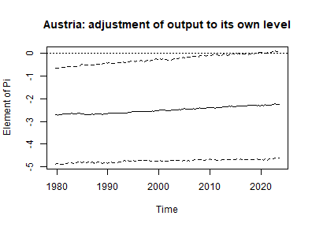
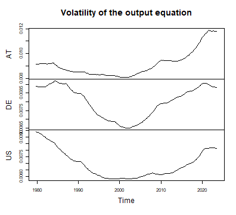
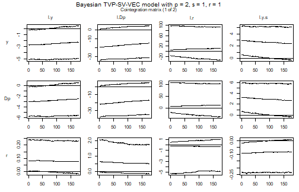
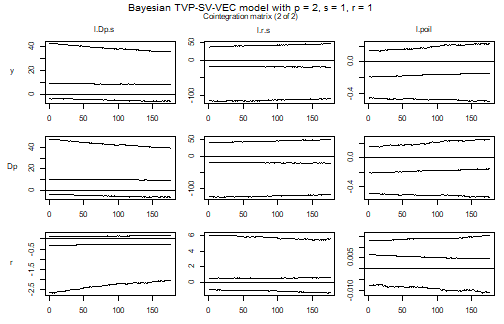
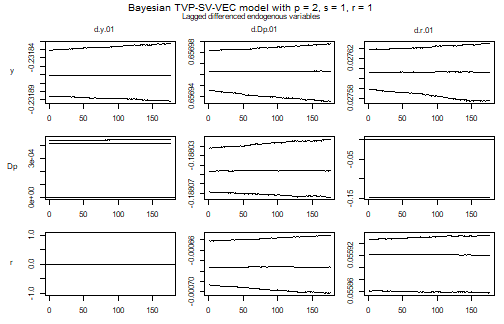
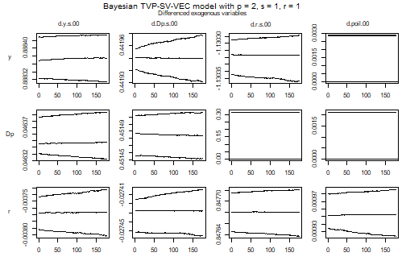
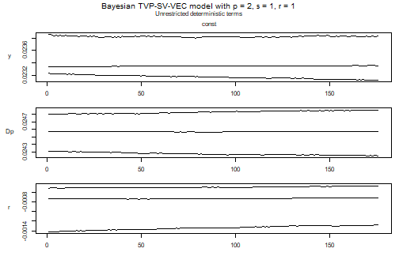
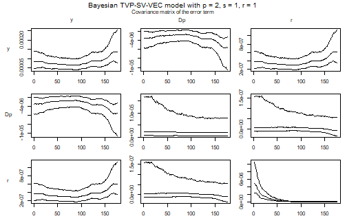

## Introduction

The companion vignette on time varying parameters and stochastic volatility in
GVAR sub-models describes what `tvp`, `error` and `varsel` do, and why the prior
on the variances of the coefficient random walks is the choice that matters most
in a sub-model. This one covers the error correction case, where the same three
arguments reach one block more: the cointegration term.

A GVEC sub-model is a VECX\* model,

$$\Delta y_{it} = \Pi_{i,t} w_{it} + \sum_{l=1}^{p-1} \Gamma_{il,t} \Delta y_{i,t-l}
+ \sum_{l=0}^{q-1} \Upsilon_{il,t} \Delta x_{i,t-l} + C_{i,t} d_t + u_{it},$$

with $\Pi_{i,t} = \alpha_{i,t} \beta_{i,t}^{\prime}$ of rank $r_i$, where
$w_{it}$ collects the levels of the country's own variables, of its weakly
exogenous foreign variables and of the global variables. With `tvp = TRUE` the
loadings and the coefficients of the differenced regressors follow random walks
and the cointegration vectors get a state equation of their own,

$$\beta_{i,t} = \rho \beta_{i,t-1} + \eta_{it}, \qquad \eta_{it} \sim N(0, I),$$

after Koop, León-González and Strachan (2011). The long-run relationship of each
country is therefore allowed to move, which is the question these models are for
and the one thing a GVAR sub-model cannot ask.

## Data


``` r
library(bgvars)

data("gvar2023")

global_data <- gvar2023[["global_data"]][, "poil", drop = FALSE]
submodel_data <- select_list_elements(gvar2023[["submodel_data"]],
                                      c("AT", "DE", "US"))
```

Three countries, output, inflation and the short-term interest rate, as in the
GVAR vignette and for the same reasons: the example stays small, and the
deflated exchange rate of the US model in this data set is minus the US price
level by construction, so a sub-model containing both it and inflation has an
exactly singular error covariance matrix.

## Model set-up


``` r
object <- create_gvecmodel(submodel_data = submodel_data,
                           global_data = global_data)

object <- add_weight_matrices(object,
                              submodel_data = submodel_data,
                              period = 3)
```


``` r
object <- add_submodels(object,
                        endogen = c("y", "Dp", "r"),
                        p_endogen = 2,
                        exogen = c("y", "Dp", "r"),
                        p_exogen = 1,
                        global = "poil",
                        s = 1,
                        r = 1,
                        const = "unrestricted",
                        tvp = TRUE,
                        error = "sv+covar",
                        varsel = "bvs",
                        iterations = 2000,
                        burnin = 1000)

object <- align_model_obs(object)

object[["submodels"]][["AT"]][[1]][["model"]][["algorithm"]]
#> [1] "VecTvpStochvol"
```

`p_endogen` is the lag order of the level VAR, so each sub-model contains
$p - 1 = 1$ lag of the differenced endogenous variables. The error correction
term holds the levels of everything the sub-model sees:


``` r
model_at <- object[["submodels"]][["AT"]][[1]]

dimnames(model_at[["data"]][["train"]][["w"]])[[2]]
#> [1] "l.y"    "l.Dp"   "l.r"    "l.y.s"  "l.Dp.s" "l.r.s"  "l.poil"
```

The first three are Austria's own variables, the next three the weakly exogenous
foreign variables that the weight matrices produced, and the last the oil price.
A cointegration rank of one says that the seven of them are tied together by a
single long-run relationship.

## Priors


``` r
object <- add_priors(object,
                     coef = list(v_i = 1, v_i_det = 1 / 10,
                                 shape = 3, rate = 1e-12, rate_det = 1e-10),
                     coint = list(rho = 0.999),
                     sigma = list(shape = 3, rate = 0.01,
                                  mu = 0, v_i = 0.01,
                                  state_variance = 0.05, offset = 1e-8),
                     varsel = list(inprior = 0.5, exclude_det = TRUE))

object <- add_initial_values(object)
```

`coef` and `sigma` are the lists of the GVAR vignette, including the small
`coef$rate`, which is what keeps a sub-model with many coefficients and a short
sample from fitting its own residuals away. It is smaller still here. An error
correction sub-model carries the loadings on top of the coefficients of the
differenced regressors, and the series in the error correction term are levels,
so a given amount of drift in a loading moves the fitted value by much more than
the same drift in a coefficient on a differenced regressor. At `1e-8` the
residual standard deviation of the output equation is 0.006 against 0.009 at
`1e-12`, where the estimates stop changing; the diagnostic below is what that
comparison looks like.

`coint` is what an error correction model adds. For a time varying sub-model it
takes `rho`, the autocorrelation of the state equation of $\beta$, and not the
`v_i` and `p_tau_i` of the cointegration space prior, which a constant
coefficient sub-model takes instead. `rho` must be smaller than one: the prior
on the state before the sample is the stationary distribution of that equation,
$N(0, I / (1 - \rho^2))$, and it is what makes the prior proper, so a value close
to one is intended and one far from it draws a warning. Since only the product
$\alpha_t \beta_t^{\prime}$ is identified, the prior variance of the loadings is
shrunk by $1 - \rho^2$ to compensate, which leaves the product on the scale that
`coef$v_i` asks for.

Variable selection never reaches the loadings. They are the first $K r$
coefficients of a sub-model and are dropped from the selection, because the
cointegration term is drawn in a step of its own, so the columns of $\Pi$ are
always in the model whatever `inprior` says. `exclude_det = TRUE` keeps the
unrestricted constant out of the selection as well, which leaves the
coefficients of the differenced regressors as the only ones being selected over.

## Posterior draws


``` r
object <- add_posterior_coefficients(object)
```

The series in an error correction term are on very different scales -- a log
level, an inflation rate and an oil price in the same term -- while the prior on
the cointegration space treats them alike. `add_posterior_coefficients` therefore
divides them by the standard deviation of their differences before simulating
and puts the draws back afterwards, which is exact: with $D$ the diagonal matrix
of factors, $\alpha (D \beta)^{\prime} (D^{-1} w)$ is the same term. Pass
`scale_ect = FALSE` to simulate on the scale of the data instead.

## Evaluation

### Summary statistics for a period


``` r
model_at <- object[["submodels"]][["AT"]][[1]]

summary(model_at)
#> 
#> Bayesian TVP-SV-VEC model with p = 2 and s = 1 
#> 
#> Variable selection algorithm: Bayesian variable selection (Korobilis, 2013)
#> 
#> Endogenous variables: y, Dp, r
#> 
#> Period: 176 
#> 
#> Variable: y 
#> 
#>                    Mean           SD     Naive SD Time-series SD          2.5%
#> l.y        -2.247811069 1.435520e+00 3.209920e-02   4.547641e-01   -4.97780937
#> l.Dp      -14.434072005 9.343448e+00 2.089259e-01   3.130636e+00  -31.29393810
#> l.r        19.488297256 3.413736e+01 7.633345e-01   2.047151e+01  -32.45774891
#> l.y.s       2.426046484 1.418498e+00 3.171859e-02   4.208894e-01   -0.29168627
#> l.Dp.s      9.970762608 1.049159e+01 2.345991e-01   5.233842e+00   -5.92021251
#> l.r.s     -24.657547255 4.133308e+01 9.242357e-01   2.252331e+01 -107.94085307
#> l.poil     -0.137748609 1.868724e-01 4.178594e-03   3.819586e-02   -0.49341533
#> d.y.01     -0.231858788 1.966699e-05 4.397672e-07   8.987418e-06   -0.23189182
#> d.Dp.01     0.656962749 1.337765e-05 2.991333e-07   3.049341e-06    0.65693567
#> d.r.01      0.027303459 2.880245e-03 6.440423e-05   1.202731e-04    0.02757775
#> d.y.s.00    0.888374995 3.911863e-05 8.747192e-07   4.112635e-05    0.88831457
#> d.Dp.s.00   0.441507726 1.397218e-02 3.124275e-04   4.314078e-04    0.44193117
#> d.r.s.00   -1.129753800 2.527471e-02 5.651596e-04   5.651596e-04   -1.13035405
#> d.poil.00   0.002449493 1.001043e-03 2.238401e-05   4.562866e-05    0.00000000
#> const       0.023387592 1.752157e-04 3.917943e-06   6.185561e-05    0.02311858
#>                     50%       97.5% Incl. prob.  
#> l.y        -2.241399630  0.45594169      1.0000  
#> l.Dp      -14.987632103  4.70515755      1.0000  
#> l.r        11.798921525 93.65455686      1.0000  
#> l.y.s       2.438937049  5.13243390      1.0000  
#> l.Dp.s      8.167743135 35.75015485      1.0000  
#> l.r.s     -19.767780835 45.26025134      1.0000  
#> l.poil     -0.139269959  0.22860846      1.0000  
#> d.y.01     -0.231860693 -0.23182301      1.0000 *
#> d.Dp.01     0.656963115  0.65698850      1.0000 *
#> d.r.01      0.027606609  0.02763539      0.9890 *
#> d.y.s.00    0.888374577  0.88843385      1.0000 *
#> d.Dp.s.00   0.441949858  0.44196804      0.9990 *
#> d.r.s.00   -1.130317034 -1.13028803      0.9995 *
#> d.poil.00   0.002856388  0.00289341      0.8570  
#> const       0.023353435  0.02383127      1.0000 *
#> 
#> Variable: Dp 
#> 
#>                    Mean           SD     Naive SD Time-series SD          2.5%
#> l.y       -2.518556e+00 1.610769e+00 3.601788e-02   5.125385e-01   -5.60868581
#> l.Dp      -1.617819e+01 1.043526e+01 2.333396e-01   3.499141e+00  -34.72642983
#> l.r        2.169584e+01 3.801204e+01 8.499751e-01   2.264457e+01  -36.30293076
#> l.y.s      2.718358e+00 1.592151e+00 3.560157e-02   4.755369e-01   -0.32332580
#> l.Dp.s     1.113773e+01 1.165261e+01 2.605602e-01   5.769139e+00   -6.61818075
#> l.r.s     -2.754230e+01 4.601807e+01 1.028995e+00   2.493146e+01 -119.91877246
#> l.poil    -1.543101e-01 2.087218e-01 4.667162e-03   4.246123e-02   -0.55000520
#> d.y.01     4.075470e-04 6.910193e-05 1.545166e-06   3.304431e-06    0.00000000
#> d.Dp.01   -1.880452e-01 1.513617e-05 3.384550e-07   3.688570e-06   -0.18807409
#> d.r.01    -1.058735e-01 6.595832e-02 1.474873e-03   4.737361e-03   -0.14697660
#> d.y.s.00   4.635339e-02 2.110852e-05 4.720008e-07   1.391304e-05    0.04632250
#> d.Dp.s.00  4.514833e-01 1.784305e-05 3.989828e-07   9.890172e-06    0.45145137
#> d.r.s.00   3.091625e-01 5.102117e-02 1.140868e-03   4.171565e-03    0.00000000
#> d.poil.00  9.430602e-04 1.044011e-03 2.334481e-05   1.393336e-04    0.00000000
#> const      2.455888e-02 1.570757e-04 3.512319e-06   5.541420e-05    0.02424421
#>                     50%         97.5% Incl. prob.  
#> l.y       -2.503914e+00  5.100841e-01      1.0000  
#> l.Dp      -1.685898e+01  5.241579e+00      1.0000  
#> l.r        1.323455e+01  1.036074e+02      1.0000  
#> l.y.s      2.729706e+00  5.772390e+00      1.0000  
#> l.Dp.s     9.178746e+00  3.960492e+01      1.0000  
#> l.r.s     -2.211075e+01  5.053723e+01      1.0000  
#> l.poil    -1.557224e-01  2.507987e-01      1.0000  
#> d.y.01     4.175144e-04  4.508081e-04      0.9735  
#> d.Dp.01   -1.880462e-01 -1.880132e-01      1.0000 *
#> d.r.01    -1.469366e-01  0.000000e+00      0.7205  
#> d.y.s.00   4.634734e-02  4.639313e-02      1.0000 *
#> d.Dp.s.00  4.514839e-01  4.515165e-01      1.0000 *
#> d.r.s.00   3.175783e-01  3.176130e-01      0.9735  
#> d.poil.00  0.000000e+00  2.133372e-03      0.4495  
#> const      2.456711e-02  2.485814e-02      1.0000 *
#> 
#> Variable: r 
#> 
#>                    Mean           SD     Naive SD Time-series SD          2.5%
#> l.y        8.781492e-02 6.642175e-02 1.485235e-03   2.626929e-02 -0.0139357893
#> l.Dp       5.784217e-01 4.599598e-01 1.028501e-02   1.802195e-01 -0.1220396606
#> l.r       -9.417276e-01 1.587955e+00 3.550775e-02   1.039230e+00 -4.8204405908
#> l.y.s     -9.375547e-02 6.603133e-02 1.476505e-03   2.546187e-02 -0.2330367563
#> l.Dp.s    -4.301728e-01 5.555566e-01 1.242262e-02   2.585721e-01 -2.0468552627
#> l.r.s      1.191544e+00 1.848668e+00 4.133746e-02   1.087781e+00 -1.2650900672
#> l.poil     4.126962e-03 6.569126e-03 1.468901e-04   1.139845e-03 -0.0110258093
#> d.y.01     1.805166e-05 3.046707e-04 6.812644e-06   1.363606e-05  0.0000000000
#> d.Dp.01   -6.744862e-04 2.583317e-05 5.776471e-07   2.702467e-06 -0.0007008122
#> d.r.01     5.591629e-02 2.319124e-05 5.185719e-07   9.773214e-06  0.0558569301
#> d.y.s.00  -3.712964e-03 4.508052e-04 1.008031e-05   2.090414e-05 -0.0038015064
#> d.Dp.s.00 -2.742834e-02 1.280877e-05 2.864127e-07   2.840952e-06 -0.0274548791
#> d.r.s.00   8.476795e-01 2.481075e-05 5.547853e-07   2.075729e-05  0.8476368962
#> d.poil.00  9.532381e-04 1.585721e-05 3.545780e-07   7.216858e-06  0.0009243815
#> const     -7.669889e-04 2.138056e-04 4.780838e-06   1.065255e-04 -0.0012784342
#>                     50%         97.5% Incl. prob.  
#> l.y        0.0763104232  0.2322414868      1.0000  
#> l.Dp       0.5199085967  1.7436005339      1.0000  
#> l.r       -0.3587951212  0.9859645670      1.0000  
#> l.y.s     -0.0829722698  0.0082710856      1.0000  
#> l.Dp.s    -0.2724356400  0.1792970243      1.0000  
#> l.r.s      0.6286040601  5.5269909420      1.0000  
#> l.poil     0.0047786385  0.0153627790      1.0000  
#> d.y.01     0.0000000000  0.0000000000      0.0035  
#> d.Dp.01   -0.0006760979 -0.0006459863      0.9990 *
#> d.r.01     0.0559204020  0.0559538243      1.0000 *
#> d.y.s.00  -0.0037667069 -0.0037328599      0.9855 *
#> d.Dp.s.00 -0.0274277713 -0.0274046167      1.0000 *
#> d.r.s.00   0.8476806284  0.8477213310      1.0000 *
#> d.poil.00  0.0009527817  0.0009856375      1.0000 *
#> const     -0.0007174514 -0.0004724195      1.0000 *
#> 
#> Variance-covariance matrix:
#> 
#>                Mean           SD     Naive SD Time-series SD          2.5%
#> y_y    1.423511e-04 4.588159e-05 1.025944e-06   3.117219e-06  7.844512e-05
#> y_Dp  -5.877387e-06 1.894342e-06 4.235878e-08   1.287238e-07 -1.051065e-05
#> y_r    6.388057e-07 2.059355e-07 4.604857e-09   1.404180e-08  3.521051e-07
#> Dp_Dp  2.429227e-06 1.951016e-06 4.362604e-08   3.508000e-07  5.646590e-07
#> Dp_r  -3.793634e-09 2.263008e-08 5.060241e-10   3.855058e-09 -3.478868e-08
#> r_r    5.711788e-08 2.607819e-08 5.831261e-10   1.141931e-09  2.480093e-08
#>                 50%         97.5%  
#> y_y    1.350070e-04  2.545293e-04 *
#> y_Dp  -5.575165e-06 -3.240604e-06 *
#> y_r    6.056164e-07  1.142119e-06 *
#> Dp_Dp  1.885332e-06  7.774622e-06 *
#> Dp_r  -7.609887e-09  5.545449e-08  
#> r_r    5.128316e-08  1.229179e-07 *
```

The first block of columns is the cointegration matrix $\Pi_t$ rather than
$\alpha_t$ and $\beta_t$ separately, since the factors are identified only up to
an invertible $r \times r$ transformation while their product is not. The table
describes the last period of the sample; argument `period` asks for another one.
The inclusion probabilities of the $\Pi$ columns are one by construction.

### Which regressors the sub-models keep


``` r
inclusion <- function(object) {
  k <- object[["model"]][["k_endogen"]]
  r <- object[["model"]][["rank"]]

  # The draws are vec(A), so one column of this matrix is one regressor. The
  # first r of them are the loadings, which are never selected over.
  result <- matrix(colMeans(object[["posterior"]][["a"]][["lambda"]]), k)
  result <- round(result[, -seq_len(r), drop = FALSE], 2)

  dimnames(result) <- list(object[["model"]][["endogen"]],
                           dimnames(object[["data"]][["train"]][["x"]])[[2]])
  result
}

lapply(object[["submodels"]], function(x) {inclusion(x[[1]])})
#> $AT
#>    d.y.01 d.Dp.01 d.r.01 d.y.s.00 d.Dp.s.00 d.r.s.00 d.poil.00 const
#> y    1.00       1   0.99     1.00         1     1.00      0.86     1
#> Dp   0.97       1   0.72     1.00         1     0.97      0.45     1
#> r    0.00       1   1.00     0.99         1     1.00      1.00     1
#> 
#> $DE
#>    d.y.01 d.Dp.01 d.r.01 d.y.s.00 d.Dp.s.00 d.r.s.00 d.poil.00 const
#> y    0.98    1.00   1.00     1.00      0.98     1.00      0.99     1
#> Dp   0.89    0.72   0.96     0.92      1.00     0.72      0.90     1
#> r    0.93    1.00   1.00     0.77      0.98     1.00      0.95     1
#> 
#> $US
#>    d.y.01 d.Dp.01 d.r.01 d.y.s.00 d.Dp.s.00 d.r.s.00 d.poil.00 const
#> y    0.99    0.77   0.99     1.00      0.80     0.99      0.98     1
#> Dp   0.86    0.60   1.00     0.83      0.94     0.86      1.00     1
#> r    0.69    0.49   1.00     0.82      0.92     0.86      0.95     1
```

One inclusion parameter is drawn per coefficient rather than per coefficient and
period, so a regressor is either in a sub-model over the whole sample or out of
it over the whole sample. The loadings are dropped from the table above because
they are never selected over.

### The long-run relationship over time


``` r
pi_path <- function(object, equation, variable, ci = 0.9) {
  k <- object[["model"]][["k_endogen"]]
  r <- object[["model"]][["rank"]]
  m <- ncol(object[["data"]][["train"]][["z"]])
  k_ect <- ncol(object[["data"]][["train"]][["w"]])
  tt <- nrow(object[["data"]][["train"]][["y"]])
  draws <- nrow(object[["posterior"]][["a"]][["coeffs"]])

  i <- which(object[["model"]][["endogen"]] == equation)
  j <- which(dimnames(object[["data"]][["train"]][["w"]])[[2]] == variable)

  result <- matrix(NA_real_, draws, tt)
  for (period in 1:tt) {
    alpha <- object[["posterior"]][["a"]][["coeffs"]][, (period - 1) * m + 1:(k * r)]
    beta <- object[["posterior"]][["beta"]][["coeffs"]][, (period - 1) * k_ect * r + 1:(k_ect * r)]
    result[, period] <- rowSums(matrix(alpha, draws, k * r)[, k * 0:(r - 1) + i, drop = FALSE] *
                                  matrix(beta, draws, k_ect * r)[, k_ect * 0:(r - 1) + j, drop = FALSE])
  }

  bands <- t(apply(result, 2, stats::quantile,
                   probs = c((1 - ci) / 2, .5, 1 - (1 - ci) / 2)))

  stats::ts(bands, start = stats::start(object[["data"]][["train"]][["y"]]),
            frequency = stats::frequency(object[["data"]][["train"]][["y"]]))
}

path <- pi_path(model_at, equation = "y", variable = "l.y")

stats::ts.plot(path, lty = c(2, 1, 2),
               main = "Austria: adjustment of output to its own level",
               ylab = "Element of Pi")
abline(h = 0, lty = "dotted")
```

<div class="figure" style="text-align: center">

<p class="caption">plot of chunk pi-path</p>
</div>

Only $\Pi_t$ is plotted, not $\beta_t$. A cointegration vector is identified up
to normalisation, and normalising it on a variable whose coefficient wanders near
zero produces a path that swings between large values without anything having
happened to the model. $\Pi_t$ carries the same information and is identified.

### Volatility across countries


``` r
volatility <- function(object, variable) {
  k <- object[["model"]][["k"]]
  kk <- k * k
  tt <- nrow(object[["data"]][["train"]][["y"]])
  draws <- object[["posterior"]][["u_sigma_inv"]][["coeffs"]]
  i <- which(object[["model"]][["endogen"]] == variable)

  result <- rep(NA_real_, tt)
  for (period in 1:tt) {
    result[period] <- mean(apply(draws[, (period - 1) * kk + 1:kk], 1,
                                 function(x, k, i) {
                                   sqrt(solve(matrix(x, k))[i, i])
                                 }, k = k, i = i))
  }

  stats::ts(result, start = stats::start(object[["data"]][["train"]][["y"]]),
            frequency = stats::frequency(object[["data"]][["train"]][["y"]]))
}

paths <- sapply(object[["submodels"]], function(x) {volatility(x[[1]], "y")})
paths <- stats::ts(paths,
                   start = stats::start(model_at[["data"]][["train"]][["y"]]),
                   frequency = 4)

plot(paths, main = "Volatility of the output equation")
```

<div class="figure" style="text-align: center">

<p class="caption">plot of chunk volatility</p>
</div>

The equations are in differences, so these are the volatilities of the shocks to
output growth, and they rise into the 2020s without spiking. That is worth
dwelling on, because it is not what the raw data look like: Austrian output fell
by ten percent in 2020Q2, six standard deviations of its own growth rate.

The reason is what a GVAR sub-model is for. The weakly exogenous foreign
variables enter contemporaneously, and the pandemic hit every country in the
same quarter, so the foreign block explains the fall rather than leaving it as an
own-country shock. Dropping that block from the same regression puts it back:


``` r
model_at <- object[["submodels"]][["AT"]][[1]]

y <- model_at[["data"]][["train"]][["y"]]
w <- model_at[["data"]][["train"]][["w"]]
x <- model_at[["data"]][["train"]][["x"]]

ls_residuals <- function(regressors) {
  d <- cbind(w, regressors)
  as.numeric(y[, 1] - d %*% (solve(crossprod(d)) %*% crossprod(d, y[, 1])))
}

foreign <- endsWith(dimnames(x)[[2]], ".s.00")
quarter <- which(stats::time(y) == 2020.25)

data.frame(residual_2020Q2 = c(ls_residuals(x)[quarter],
                               ls_residuals(x[, !foreign, drop = FALSE])[quarter]),
           row.names = c("with the foreign block", "without it"))
#>                        residual_2020Q2
#> with the foreign block     -0.01344996
#> without it                 -0.09304060
```

A global shock is not an own-country shock, and a sub-model says so by leaving it
out of its own error term. What the volatility of a sub-model measures is what is
idiosyncratic to that country once the rest of the world has been conditioned on.

### Coefficient and volatility paths of a sub-model


``` r
plot(model_at)
```

<div class="figure" style="text-align: center">

<p class="caption">plot of chunk paths</p>
</div><div class="figure" style="text-align: center">

<p class="caption">plot of chunk paths</p>
</div><div class="figure" style="text-align: center">

<p class="caption">plot of chunk paths</p>
</div><div class="figure" style="text-align: center">

<p class="caption">plot of chunk paths</p>
</div><div class="figure" style="text-align: center">

<p class="caption">plot of chunk paths</p>
</div><div class="figure" style="text-align: center">

<p class="caption">plot of chunk paths</p>
</div>

Each block of coefficients gets a figure of its own: the cointegration matrix
$\Pi_t$, the lagged differences $\Gamma$, the differenced weakly exogenous and
global variables $\Upsilon$, the unrestricted constant, and the covariance
matrix of the error term. A sub-model with two dozen regressors drawn as one
figure leaves each panel narrower than its own axis labels, which is what this
avoids. A panel at a flat zero among the $\Gamma$ and $\Upsilon$ coefficients is
one that variable selection switched off.

## What cannot be done yet

A GVEC model is solved by rewriting every sub-model in levels with
`gvec_to_gvar` and stacking the result with `submodels_to_gvar`. The first step
refuses a time varying sub-model:


``` r
gvec_to_gvar(object)
#> Error in `vec_to_var.vecxsubmodel()`:
#> ! Global variables in a GVEC sub-model are not supported yet.
#> Feel free to send a feature request.
```

The transformation writes the coefficients of one draw as the coefficients of the
corresponding level VARX, and a time varying model has one such VARX per period
and per draw, so what would come back is not the object the rest of the package
works on. `submodels_to_gvar` refuses time varying and stochastic volatility
sub-models for the same reason, so the road ends in the same place as in the
GVAR vignette: the paths and the period-wise summaries above are what a time
varying specification gives, and a solved global model is built from sub-models
with constant coefficients.

Two further limits are worth knowing before they are met. Sub-models that use a
global block cannot be rewritten in levels at all, whether or not they are time
varying, so the restriction above is not the only thing standing between this
object and a solved model. And `add_posterior_loglik` has no algorithm for time
varying error correction models, so the selection criteria that choose between
competing sub-model specifications are not available for them: a specification
search is run on constant coefficient sub-models, and the time varying model is
estimated for the one that wins.

Variable selection is available as `varsel = "bvs"`. SSVS is not implemented for
error correction sub-models and is refused when the priors are added.

## References

Chudik, A., & Pesaran, M. H. (2016). Theory and practice of GVAR modelling. *Journal of Economic Surveys 30*(1), 165-197. <https://doi.org/10.1111/joes.12095>

Koop, G., León-González, R., & Strachan R. W. (2011). Bayesian inference in a time varying cointegration model. *Journal of Econometrics, 165*(2), 210-220. <https://doi.org/10.1016/j.jeconom.2011.07.007>

Korobilis, D. (2013). VAR forecasting using Bayesian variable selection. *Journal of Applied Econometrics, 28*(2), 204-230. <https://doi.org/10.1002/jae.1271>

Mohaddes, K., & Raissi, M. (2024). *Compilation, revision and updating of the global VAR (GVAR) database, 1979Q2--2023Q3* (mimeo). University of Cambridge: Judge Business School. <https://www.mohaddes.org/gvar>

Pesaran, M. H., Schuermann, T., & Weiner, S. M. (2004). Modeling regional interdependencies using a global error-correcting macroeconometric model. *Journal of Business & Economic Statistics 22*(2), 129-162. <https://doi.org/10.1198/073500104000000019>
