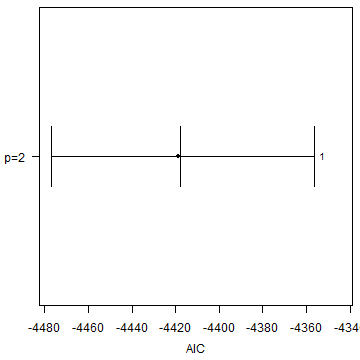
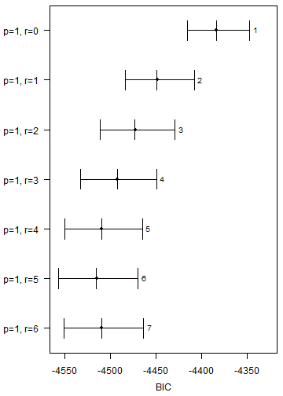
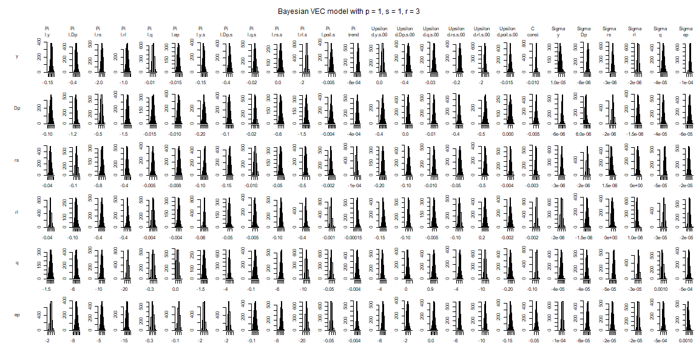

### Prepare GVEC data


``` r
library(bgvars)
data("dees2007")

submodel_data <- dees2007[["submodel_data"]]
global_data <- dees2007[["global_data"]]
```


``` r
# Add global series to US series
vars_us <- c(dimnames(submodel_data[["US"]][["endogen"]])[[2]], "poil")
submodel_data[["US"]][["endogen"]] <- cbind(submodel_data[["US"]][["endogen"]], global_data)
dimnames(submodel_data[["US"]][["endogen"]])[[2]] <- vars_us
```


``` r
object <- create_gvecmodel(submodel_data = submodel_data)
```

Weight matrices for each country/region can be calculated with the function `add_weight_matrices`.


``` r
# Generate weight matrices
object <- add_weight_matrices(object = object,
                              submodel_data = submodel_data,
                              period = 1999:2001)
```


### Model specification

#### Determine the number of lags


``` r
submodel <- create_varxsubmodel(object,
                                submodel = "EA",
                                endogen = c("y", "Dp", "rs", "rl", "q", "ep"),
                                p_endogen = 2,
                                exogen = c("y", "Dp", "q", "rs", "rl", "poil"),
                                p_exogen = 2,
                                deterministic = "const",
                                iterations = 2000,
                                burnin = 1000)
```


### Prior specification


``` r
submodel <- add_priors(submodel,
                       coef = list(v_i = 0),
                       sigma = list(df = 3, scale = 0.0001))
```

### Initial values


``` r
submodel <- add_initial_values(submodel)
```

### Posterior simulation


``` r
submodel <- add_posterior_coefficients(submodel)
```


``` r
submodel <- add_posterior_loglik(submodel)
```

### Model selection


``` r
sc <- selection_criteria(submodel)
```


``` r
sc
#> 
#> ------------------------------------------
#> In-sample
#> ------------------------------------------
#> 
#> Log-likelihood
#> 
#>          Mean Median Quantile (2.5%) Quantile (97.5%)
#>  Model 1 2240   2240            2209             2270
#> 
#> 
#> Akaike Information Criterion (AIC)
#> 
#>           Mean Median Quantile (2.5%) Quantile (97.5%)
#>  Model 1 -4419  -4418           -4477            -4356
#> 
#> 
#> Bayesian Information Criterion (BIC)
#> 
#>           Mean Median Quantile (2.5%) Quantile (97.5%)
#>  Model 1 -4339  -4338           -4397            -4276
#> 
#> 
#> Hannan-Quinn Criterion (HQ)
#> 
#>           Mean Median Quantile (2.5%) Quantile (97.5%)
#>  Model 1 -4386  -4386           -4445            -4324
```


``` r
plot(sc, criterion = "AIC")
```




#### Determine the rank


``` r
submodel <- create_vecxsubmodel(object,
                                submodel = "EA",
                                endogen = c("y", "Dp", "rs", "rl", "q", "ep"),
                                p_endogen = 1,
                                exogen = c("y", "Dp", "q", "rs", "rl", "poil"),
                                p_exogen = 1,
                                r = NULL,
                                const = "unrestricted",
                                trend = "restricted",
                                iterations = 2000,
                                burnin = 1000)
#> Argument rank 'r' not specified. Generating models for r = 0, 1, 2, 3, 4, 5, 6.
```


### Prior specification


``` r
submodel <- add_priors(submodel,
                     coef = list(v_i = 0),
                     coint = list(v_i = 0, p_tau_i = 1),
                     sigma = list(df = 3, scale = 0.0001))
```

### Initial values


``` r
submodel <- add_initial_values(submodel)
```

### Posterior simulation


``` r
submodel <- add_posterior_coefficients(submodel)
```


``` r
submodel <- add_posterior_loglik(submodel)
```

### Model selection


``` r
sc <- selection_criteria(submodel)
```


``` r
sc
#> 
#> ------------------------------------------
#> In-sample
#> ------------------------------------------
#> 
#> Log-likelihood
#> 
#>          Mean Median Quantile (2.5%) Quantile (97.5%)
#>  Model 1 2208   2208            2190             2224
#>  Model 2 2243   2243            2222             2260
#>  Model 3 2257   2257            2235             2276
#>  Model 4 2269   2269            2248             2289
#>  Model 5 2280   2280            2258             2301
#>  Model 6 2285   2285            2262             2306
#>  Model 7 2285   2285            2262             2305
#> 
#> 
#> Akaike Information Criterion (AIC)
#> 
#>           Mean Median Quantile (2.5%) Quantile (97.5%)
#>  Model 1 -4402  -4402           -4434            -4365
#>  Model 2 -4469  -4470           -4504            -4429
#>  Model 3 -4496  -4496           -4535            -4453
#>  Model 4 -4518  -4518           -4559            -4475
#>  Model 5 -4538  -4538           -4579            -4493
#>  Model 6 -4546  -4547           -4588            -4501
#>  Model 7 -4543  -4543           -4585            -4497
#> 
#> 
#> Bayesian Information Criterion (BIC)
#> 
#>           Mean Median Quantile (2.5%) Quantile (97.5%)
#>  Model 1 -4384  -4384           -4416            -4347
#>  Model 2 -4448  -4449           -4484            -4408
#>  Model 3 -4473  -4473           -4511            -4429
#>  Model 4 -4493  -4492           -4533            -4449
#>  Model 5 -4509  -4510           -4551            -4465
#>  Model 6 -4515  -4516           -4557            -4470
#>  Model 7 -4509  -4510           -4551            -4464
#> 
#> 
#> Hannan-Quinn Criterion (HQ)
#> 
#>           Mean Median Quantile (2.5%) Quantile (97.5%)
#>  Model 1 -4395  -4395           -4426            -4358
#>  Model 2 -4461  -4461           -4496            -4421
#>  Model 3 -4486  -4487           -4525            -4443
#>  Model 4 -4508  -4508           -4548            -4465
#>  Model 5 -4526  -4527           -4568            -4482
#>  Model 6 -4534  -4534           -4576            -4488
#>  Model 7 -4529  -4530           -4571            -4484
```


``` r
plot(sc, criterion = "BIC")
```




``` r
result <- submodel[[4]]
```


``` r
summary(result)
#> 
#> Bayesian VEC model with p = 1 and s = 1 
#> 
#> Endogenous variables: y, Dp, rs, rl, q, ep
#> 
#> Variable: y 
#> 
#>                      Mean           SD     Naive SD Time-series SD
#> l.y          1.981618e-02 0.0403714950 9.027341e-04   1.191151e-03
#> l.Dp         1.907378e-01 0.1580012661 3.533016e-03   5.798023e-03
#> l.rs        -1.076267e+00 0.2899930196 6.484441e-03   9.248371e-03
#> l.rl         4.109245e-01 0.4241100535 9.483389e-03   1.166525e-02
#> l.q          5.715081e-03 0.0053708882 1.200967e-04   1.950431e-04
#> l.ep        -2.569319e-03 0.0044314628 9.909052e-05   1.529314e-04
#> l.y.s       -2.257971e-02 0.0412346415 9.220346e-04   1.231713e-03
#> l.Dp.s      -6.989775e-02 0.0981235983 2.194110e-03   3.744250e-03
#> l.q.s       -2.007972e-03 0.0073568276 1.645037e-04   2.919013e-04
#> l.rs.s       2.790700e-01 0.1237772046 2.767742e-03   4.899148e-03
#> l.rl.s       2.358475e-01 0.4720463147 1.055528e-02   1.564080e-02
#> l.poil.s     1.238999e-03 0.0020095199 4.493423e-05   6.146759e-05
#> trend       -4.659565e-05 0.0001254949 2.806152e-06   4.202351e-06
#> d.y.s.00     4.609289e-01 0.1182465601 2.644073e-03   4.288578e-03
#> d.Dp.s.00   -7.679145e-02 0.0907808116 2.029921e-03   3.134860e-03
#> d.q.s.00    -1.276864e-03 0.0079081868 1.768324e-04   2.343141e-04
#> d.rs.s.00    1.727552e-01 0.0992333819 2.218926e-03   2.578458e-03
#> d.rl.s.00    3.649151e-01 0.5398836665 1.207217e-02   1.478709e-02
#> d.poil.s.00 -1.863738e-03 0.0033021911 7.383924e-05   8.316946e-05
#> const        1.180488e-03 0.0021889738 4.894694e-05   2.317521e-04
#>                      2.5%           50%         97.5%  
#> l.y         -0.0671301554  2.059329e-02  0.0977960614  
#> l.Dp        -0.1122899197  1.916918e-01  0.5011722215  
#> l.rs        -1.6386317316 -1.074229e+00 -0.5322073821 *
#> l.rl        -0.3872456905  4.030626e-01  1.3117030929  
#> l.q         -0.0046241942  5.712549e-03  0.0162621544  
#> l.ep        -0.0113183767 -2.511245e-03  0.0061057355  
#> l.y.s       -0.1011409665 -2.372511e-02  0.0650472039  
#> l.Dp.s      -0.2727040136 -6.924578e-02  0.1255006453  
#> l.q.s       -0.0164411378 -2.047836e-03  0.0123383982  
#> l.rs.s       0.0392338091  2.751107e-01  0.5309164778 *
#> l.rl.s      -0.6872180472  2.459046e-01  1.0926066729  
#> l.poil.s    -0.0027076498  1.218296e-03  0.0052448226  
#> trend       -0.0003117923 -3.934493e-05  0.0001752477  
#> d.y.s.00     0.2287857169  4.583022e-01  0.6865538163 *
#> d.Dp.s.00   -0.2581748691 -7.766850e-02  0.1026390376  
#> d.q.s.00    -0.0162315446 -1.263979e-03  0.0143422985  
#> d.rs.s.00   -0.0209204375  1.716295e-01  0.3677987849  
#> d.rl.s.00   -0.7034909531  3.805103e-01  1.4109688871  
#> d.poil.s.00 -0.0083037221 -1.987513e-03  0.0046547620  
#> const       -0.0029925729  1.221780e-03  0.0055289176  
#> 
#> Variable: Dp 
#> 
#>                      Mean           SD     Naive SD Time-series SD
#> l.y          0.0533508960 0.0425506692 9.514619e-04   1.612800e-03
#> l.Dp        -0.6275035734 0.1464487902 3.274695e-03   5.795899e-03
#> l.rs         0.2668803468 0.2596912895 5.806874e-03   7.710178e-03
#> l.rl        -0.0602300226 0.4010375850 8.967473e-03   1.136785e-02
#> l.q         -0.0030784924 0.0046551665 1.040927e-04   1.622821e-04
#> l.ep         0.0041589107 0.0039768832 8.892581e-05   1.397593e-04
#> l.y.s       -0.0536136701 0.0438140118 9.797111e-04   1.727600e-03
#> l.Dp.s       0.2006277185 0.0949143171 2.122349e-03   4.049838e-03
#> l.q.s        0.0047324137 0.0062379831 1.394855e-04   2.386326e-04
#> l.rs.s      -0.2891341595 0.1168121933 2.612000e-03   4.862015e-03
#> l.rl.s       0.3541785943 0.4650675426 1.039923e-02   1.637484e-02
#> l.poil.s     0.0018968296 0.0019929474 4.456366e-05   5.952577e-05
#> trend        0.0001503757 0.0001340704 2.997905e-06   5.764704e-06
#> d.y.s.00    -0.0593951676 0.1027631769 2.297854e-03   4.393968e-03
#> d.Dp.s.00    0.2554219305 0.0766056364 1.712954e-03   2.724526e-03
#> d.q.s.00     0.0129920855 0.0068571620 1.533308e-04   2.206369e-04
#> d.rs.s.00   -0.1007828627 0.0823577789 1.841576e-03   2.505199e-03
#> d.rl.s.00    1.0187051628 0.4535862985 1.014250e-02   1.209675e-02
#> d.poil.s.00  0.0049959191 0.0027131759 6.066846e-05   7.318343e-05
#> const        0.0003980340 0.0018972121 4.242295e-05   1.959704e-04
#>                      2.5%           50%         97.5%  
#> l.y         -0.0285215220  0.0532237425  0.1362209314  
#> l.Dp        -0.8901667727 -0.6372097441 -0.3089831198 *
#> l.rs        -0.2466843051  0.2646832888  0.7727625050  
#> l.rl        -0.8595802041 -0.0514418335  0.7109339311  
#> l.q         -0.0120785144 -0.0030501550  0.0059399741  
#> l.ep        -0.0038216618  0.0042601851  0.0116584216  
#> l.y.s       -0.1405003833 -0.0537523545  0.0312796852  
#> l.Dp.s       0.0161243163  0.2022076831  0.3881444652 *
#> l.q.s       -0.0078347878  0.0047308002  0.0164972757  
#> l.rs.s      -0.5103772126 -0.2912541066 -0.0596727112 *
#> l.rl.s      -0.5279475736  0.3415991358  1.3047356907  
#> l.poil.s    -0.0020183875  0.0018396617  0.0059071746  
#> trend       -0.0001018370  0.0001517896  0.0004109842  
#> d.y.s.00    -0.2602302994 -0.0611688670  0.1475131843  
#> d.Dp.s.00    0.1002898193  0.2576898079  0.3999968087 *
#> d.q.s.00    -0.0003434538  0.0131459175  0.0265008718  
#> d.rs.s.00   -0.2680442234 -0.1003550013  0.0669213226  
#> d.rl.s.00    0.0964236261  1.0324200961  1.8912811209 *
#> d.poil.s.00 -0.0004163872  0.0050380321  0.0102830430  
#> const       -0.0037784303  0.0004581078  0.0040612402  
#> 
#> Variable: rs 
#> 
#>                      Mean           SD     Naive SD Time-series SD
#> l.y          1.662078e-02 1.610987e-02 3.602277e-04   6.785085e-04
#> l.Dp         7.190064e-02 6.260324e-02 1.399851e-03   2.767534e-03
#> l.rs        -3.491242e-01 1.164272e-01 2.603392e-03   3.675937e-03
#> l.rl         1.059898e-01 1.508955e-01 3.374126e-03   4.912674e-03
#> l.q          2.245701e-03 2.093030e-03 4.680156e-05   1.050539e-04
#> l.ep        -1.536214e-03 1.751546e-03 3.916577e-05   8.315508e-05
#> l.y.s       -1.904990e-02 1.668605e-02 3.731114e-04   6.928131e-04
#> l.Dp.s      -1.907961e-02 3.692166e-02 8.255934e-04   1.906859e-03
#> l.q.s       -1.027878e-03 2.877346e-03 6.433941e-05   1.447234e-04
#> l.rs.s       7.557992e-02 4.554831e-02 1.018491e-03   1.789196e-03
#> l.rl.s       1.312796e-01 1.833771e-01 4.100436e-03   8.333062e-03
#> l.poil.s     5.086810e-04 7.121366e-04 1.592386e-05   2.224755e-05
#> trend        2.281070e-05 4.887357e-05 1.092846e-06   2.159435e-06
#> d.y.s.00    -1.855995e-02 4.415104e-02 9.872472e-04   1.682033e-03
#> d.Dp.s.00   -2.150903e-02 3.305950e-02 7.392329e-04   1.072459e-03
#> d.q.s.00    -3.097801e-04 2.996130e-03 6.699550e-05   8.798486e-05
#> d.rs.s.00    8.903578e-02 3.660806e-02 8.185812e-04   1.007425e-03
#> d.rl.s.00    1.915257e-01 2.073702e-01 4.636939e-03   5.686338e-03
#> d.poil.s.00 -8.293345e-05 1.273410e-03 2.847431e-05   3.190139e-05
#> const       -3.624560e-05 7.005562e-04 1.566491e-05   7.183457e-05
#>                      2.5%           50%         97.5%  
#> l.y         -1.123052e-02  1.563544e-02  0.0505684130  
#> l.Dp        -4.783778e-02  7.146400e-02  0.1957161917  
#> l.rs        -5.888758e-01 -3.477545e-01 -0.1261752376 *
#> l.rl        -1.816024e-01  1.009432e-01  0.4258774897  
#> l.q         -1.946834e-03  2.257396e-03  0.0063517591  
#> l.ep        -4.946578e-03 -1.552002e-03  0.0018051796  
#> l.y.s       -5.409448e-02 -1.783962e-02  0.0096934925  
#> l.Dp.s      -9.066208e-02 -1.899938e-02  0.0568886758  
#> l.q.s       -6.447888e-03 -1.042783e-03  0.0047410849  
#> l.rs.s      -1.157957e-02  7.672273e-02  0.1636426852  
#> l.rl.s      -2.120591e-01  1.245456e-01  0.4955169237  
#> l.poil.s    -8.685967e-04  4.607000e-04  0.0020565920  
#> trend       -6.364216e-05  1.938673e-05  0.0001271726  
#> d.y.s.00    -1.031302e-01 -1.916540e-02  0.0679116783  
#> d.Dp.s.00   -8.696850e-02 -2.183738e-02  0.0437005494  
#> d.q.s.00    -6.058768e-03 -3.570631e-04  0.0055993615  
#> d.rs.s.00    1.935521e-02  8.897467e-02  0.1619137474 *
#> d.rl.s.00   -2.238456e-01  1.901614e-01  0.5944429293  
#> d.poil.s.00 -2.656946e-03 -9.406164e-05  0.0024573577  
#> const       -1.474760e-03 -3.248780e-05  0.0013235726  
#> 
#> Variable: rl 
#> 
#>                      Mean           SD     Naive SD Time-series SD
#> l.y          5.962624e-03 9.594505e-03 2.145397e-04   3.143010e-04
#> l.Dp         4.689397e-02 4.865221e-02 1.087896e-03   1.631953e-03
#> l.rs        -1.357775e-01 7.857651e-02 1.757024e-03   2.312881e-03
#> l.rl         3.005361e-02 8.906764e-02 1.991613e-03   2.908592e-03
#> l.q          1.027993e-03 1.437381e-03 3.214081e-05   6.430712e-05
#> l.ep        -8.137279e-04 1.184490e-03 2.648599e-05   4.976769e-05
#> l.y.s       -7.103385e-03 9.915423e-03 2.217156e-04   3.299842e-04
#> l.Dp.s      -1.232176e-02 2.292573e-02 5.126348e-04   8.230144e-04
#> l.q.s       -6.458692e-04 2.069448e-03 4.627427e-05   9.245320e-05
#> l.rs.s       3.480710e-02 3.085403e-02 6.899170e-04   1.286401e-03
#> l.rl.s       5.454790e-02 1.145194e-01 2.560733e-03   4.091417e-03
#> l.poil.s     1.298137e-04 4.134577e-04 9.245196e-06   1.174679e-05
#> trend        1.014923e-05 2.850296e-05 6.373455e-07   9.847333e-07
#> d.y.s.00    -2.150002e-02 3.594650e-02 8.037881e-04   1.160999e-03
#> d.Dp.s.00   -3.819972e-03 2.595005e-02 5.802607e-04   7.110076e-04
#> d.q.s.00    -1.207746e-04 2.352705e-03 5.260809e-05   6.025677e-05
#> d.rs.s.00    1.169786e-02 3.000837e-02 6.710075e-04   6.710075e-04
#> d.rl.s.00    7.006747e-01 1.681427e-01 3.759785e-03   4.475822e-03
#> d.poil.s.00  1.070221e-03 9.827801e-04 2.197563e-05   2.278261e-05
#> const        1.027687e-04 4.175651e-04 9.337041e-06   2.505792e-05
#>                      2.5%           50%        97.5%  
#> l.y         -1.097242e-02  4.847136e-03 2.838244e-02  
#> l.Dp        -4.667241e-02  4.662318e-02 1.428963e-01  
#> l.rs        -2.936185e-01 -1.333794e-01 1.296077e-02  
#> l.rl        -1.525584e-01  2.881277e-02 2.130569e-01  
#> l.q         -1.707417e-03  9.810439e-04 3.972655e-03  
#> l.ep        -3.331788e-03 -7.606533e-04 1.449221e-03  
#> l.y.s       -3.016406e-02 -5.841491e-03 9.510998e-03  
#> l.Dp.s      -5.817982e-02 -1.196917e-02 3.651504e-02  
#> l.q.s       -4.598410e-03 -6.519694e-04 3.459356e-03  
#> l.rs.s      -2.889763e-02  3.429148e-02 9.534301e-02  
#> l.rl.s      -1.528338e-01  4.316808e-02 3.012914e-01  
#> l.poil.s    -6.801232e-04  1.089993e-04 9.966011e-04  
#> trend       -3.907254e-05  6.460749e-06 7.733019e-05  
#> d.y.s.00    -9.184973e-02 -2.293891e-02 4.937509e-02  
#> d.Dp.s.00   -5.471071e-02 -3.634065e-03 4.919278e-02  
#> d.q.s.00    -4.662039e-03 -1.412215e-04 4.458370e-03  
#> d.rs.s.00   -4.733353e-02  1.151525e-02 6.814744e-02  
#> d.rl.s.00    3.771023e-01  6.966152e-01 1.035981e+00 *
#> d.poil.s.00 -7.970091e-04  1.036319e-03 3.084882e-03  
#> const       -7.540003e-04  1.174802e-04 9.170838e-04  
#> 
#> Variable: q 
#> 
#>                      Mean          SD     Naive SD Time-series SD          2.5%
#> l.y          0.1771592681 0.476779241 1.066111e-02   1.780104e-02  -0.736056607
#> l.Dp        -0.0010771047 1.699882971 3.801054e-02   7.457672e-02  -3.116174337
#> l.rs        -1.1899128608 3.153056567 7.050449e-02   1.027663e-01  -7.584996801
#> l.rl        -3.8430819512 4.768330670 1.066231e-01   1.457780e-01 -14.331875223
#> l.q         -0.1175583086 0.065421547 1.462870e-03   3.162738e-03  -0.241189099
#> l.ep         0.0972699013 0.058248623 1.302479e-03   2.865534e-03  -0.009197972
#> l.y.s       -0.1016728210 0.491650297 1.099363e-02   1.933679e-02  -1.055582783
#> l.Dp.s       0.5027575445 1.098279049 2.455827e-02   4.392784e-02  -1.550995283
#> l.q.s        0.1954660198 0.090836011 2.031155e-03   4.477554e-03   0.009252053
#> l.rs.s      -0.0750765074 1.359091915 3.039022e-02   5.738659e-02  -2.854756882
#> l.rl.s       8.0724982177 5.671145219 1.268107e-01   2.217599e-01  -2.027107976
#> l.poil.s     0.0054730808 0.022627661 5.059699e-04   7.268832e-04  -0.040699864
#> trend        0.0002465832 0.001494381 3.341537e-05   6.132809e-05  -0.002584274
#> d.y.s.00    -0.1609962469 1.274925451 2.850820e-02   6.030058e-02  -2.569119773
#> d.Dp.s.00    1.4794970653 0.910145050 2.035146e-02   3.008183e-02  -0.395497226
#> d.q.s.00     1.1748534290 0.083750521 1.872719e-03   2.765920e-03   1.014961291
#> d.rs.s.00   -0.3888124307 1.010845890 2.260320e-02   2.736837e-02  -2.297745223
#> d.rl.s.00    7.2982407226 5.515006411 1.233193e-01   1.617362e-01  -3.829077103
#> d.poil.s.00 -0.1250019271 0.033503227 7.491549e-04   9.550857e-04  -0.187704807
#> const        0.0004853871 0.018922280 4.231150e-04   1.272858e-03  -0.039467688
#>                       50%        97.5%  
#> l.y          0.1715355720  1.130022498  
#> l.Dp        -0.0539921726  3.456464177  
#> l.rs        -1.1795127674  5.033568852  
#> l.rl        -3.4767470293  4.366147807  
#> l.q         -0.1189234319  0.008594084  
#> l.ep         0.0969821553  0.206033898  
#> l.y.s       -0.1053046162  0.852866400  
#> l.Dp.s       0.4440912047  2.731520519  
#> l.q.s        0.1993020992  0.359131307 *
#> l.rs.s      -0.0240773423  2.535343362  
#> l.rl.s       7.9876648659 19.281475892  
#> l.poil.s     0.0059035179  0.047943824  
#> trend        0.0002175475  0.003213057  
#> d.y.s.00    -0.2096429275  2.434474232  
#> d.Dp.s.00    1.4799679292  3.221151875  
#> d.q.s.00     1.1762469835  1.342109893 *
#> d.rs.s.00   -0.3931693060  1.594465756  
#> d.rl.s.00    7.5087028532 17.820788419  
#> d.poil.s.00 -0.1257578505 -0.057716288 *
#> const        0.0010241625  0.034800451  
#> 
#> Variable: ep 
#> 
#>                      Mean          SD     Naive SD Time-series SD          2.5%
#> l.y          0.0626654618 0.464652918 1.038996e-02   1.871777e-02  -0.849535437
#> l.Dp        -0.7893307155 1.938718740 4.335107e-02   8.280689e-02  -4.516497166
#> l.rs         4.8219193497 3.307791188 7.396446e-02   1.041035e-01  -1.427374208
#> l.rl        -3.7569788498 4.332744422 9.688311e-02   1.531917e-01 -12.904009811
#> l.q         -0.0965625957 0.062074917 1.388037e-03   2.850499e-03  -0.214738068
#> l.ep         0.0613072925 0.051836267 1.159094e-03   2.459536e-03  -0.045516862
#> l.y.s       -0.0212285386 0.480639121 1.074742e-02   1.971710e-02  -0.978618770
#> l.Dp.s       0.5959888052 1.058188291 2.366181e-02   4.628440e-02  -1.471232787
#> l.q.s        0.1462033476 0.089991028 2.012261e-03   4.285005e-03  -0.024307013
#> l.rs.s      -1.6969305706 1.378482956 3.082382e-02   5.968944e-02  -4.460284759
#> l.rl.s       4.2611706466 5.424417053 1.212937e-01   2.416630e-01  -5.067220453
#> l.poil.s     0.0007742521 0.020394265 4.560296e-04   6.332042e-04  -0.038724902
#> trend        0.0005366510 0.001454197 3.251682e-05   6.412896e-05  -0.002301998
#> d.y.s.00    -1.1923806817 1.352139317 3.023475e-02   6.460831e-02  -3.827420093
#> d.Dp.s.00    0.7418976280 1.011293577 2.261321e-02   3.507301e-02  -1.205559299
#> d.q.s.00     0.3067277905 0.093912790 2.099954e-03   2.920748e-03   0.119427290
#> d.rs.s.00   -0.8715201908 1.156130557 2.585187e-02   3.518826e-02  -3.111592746
#> d.rl.s.00   11.1476119950 6.118759886 1.368196e-01   1.573818e-01  -0.126950905
#> d.poil.s.00 -0.0263401296 0.037192928 8.316592e-04   8.926246e-04  -0.097634344
#> const       -0.0004075431 0.017484569 3.909668e-04   1.166634e-03  -0.036322513
#>                       50%        97.5%  
#> l.y          0.0489508669  1.005077411  
#> l.Dp        -0.8176067235  3.100267493  
#> l.rs         4.7406789672 11.060975470  
#> l.rl        -3.5244725808  4.532863903  
#> l.q         -0.0991367471  0.027355407  
#> l.ep         0.0622376831  0.159074119  
#> l.y.s       -0.0030782082  0.933113246  
#> l.Dp.s       0.5645148877  2.793593310  
#> l.q.s        0.1490187812  0.318891744  
#> l.rs.s      -1.6123129685  0.844155228  
#> l.rl.s       3.7236051889 15.950070289  
#> l.poil.s    -0.0001022062  0.044890666  
#> trend        0.0004580723  0.003475886  
#> d.y.s.00    -1.2005423227  1.401817719  
#> d.Dp.s.00    0.7003196024  2.816420650  
#> d.q.s.00     0.3059442485  0.493807506 *
#> d.rs.s.00   -0.8830440963  1.326402819  
#> d.rl.s.00   11.0702485003 23.061381162  
#> d.poil.s.00 -0.0275534320  0.044393986  
#> const       -0.0007618403  0.034875367  
#> 
#> Variance-covariance matrix:
#> 
#>                Mean           SD     Naive SD Time-series SD          2.5%
#> y_y    1.482880e-05 2.341306e-06 5.235320e-08   6.936034e-08  1.087668e-05
#> y_Dp   4.984761e-07 1.344227e-06 3.005782e-08   4.360814e-08 -2.018530e-06
#> y_rs  -2.915637e-07 5.954780e-07 1.331529e-08   1.636735e-08 -1.443236e-06
#> y_rl  -4.929745e-08 5.019879e-07 1.122479e-08   1.345757e-08 -1.043935e-06
#> y_q    1.786800e-05 1.686134e-05 3.770310e-07   5.478073e-07 -1.518427e-05
#> y_ep  -2.492445e-07 1.926351e-05 4.307453e-07   5.552287e-07 -3.851446e-05
#> Dp_Dp  9.376877e-06 1.552319e-06 3.471092e-08   4.978386e-08  6.864234e-06
#> Dp_rs  3.541019e-07 5.334368e-07 1.192801e-08   2.000434e-08 -6.787245e-07
#> Dp_rl -6.812066e-08 4.048448e-07 9.052605e-09   1.161108e-08 -8.672281e-07
#> Dp_q   1.711732e-05 1.370288e-05 3.064058e-07   4.743083e-07 -9.586818e-06
#> Dp_ep  1.074925e-05 1.595355e-05 3.567322e-07   5.741844e-07 -2.094921e-05
#> rs_rs  2.085192e-06 3.458281e-07 7.732952e-09   1.013374e-08  1.521746e-06
#> rs_rl  2.835628e-07 1.988060e-07 4.445437e-09   5.528628e-09 -9.293955e-08
#> rs_q  -4.792758e-06 6.561131e-06 1.467113e-07   2.247088e-07 -1.734926e-05
#> rs_ep  4.671710e-06 6.986403e-06 1.562207e-07   2.467317e-07 -9.694806e-06
#> rl_rl  1.493630e-06 2.288042e-07 5.116218e-09   5.578796e-09  1.136091e-06
#> rl_q  -6.861613e-06 5.233719e-06 1.170295e-07   1.572548e-07 -1.755826e-05
#> rl_ep -2.355603e-07 5.835637e-06 1.304888e-07   1.528704e-07 -1.171376e-05
#> q_q    1.455965e-03 2.466565e-04 5.515406e-06   8.813179e-06  1.055297e-03
#> q_ep   2.074774e-04 1.959620e-04 4.381844e-06   6.017177e-06 -1.770156e-04
#> ep_ep  1.923991e-03 3.057344e-04 6.836428e-06   9.552020e-06  1.391017e-03
#>                 50%        97.5%  
#> y_y    1.464388e-05 2.020845e-05 *
#> y_Dp   5.097182e-07 3.233279e-06  
#> y_rs  -2.913334e-07 9.077328e-07  
#> y_rl  -3.405671e-08 9.221184e-07  
#> y_q    1.756826e-05 5.229591e-05  
#> y_ep  -2.610291e-08 3.690226e-05  
#> Dp_Dp  9.226711e-06 1.272832e-05 *
#> Dp_rs  3.444297e-07 1.439654e-06  
#> Dp_rl -6.536746e-08 7.295203e-07  
#> Dp_q   1.674534e-05 4.614823e-05  
#> Dp_ep  1.070451e-05 4.328270e-05  
#> rs_rs  2.045274e-06 2.913662e-06 *
#> rs_rl  2.720748e-07 6.883195e-07  
#> rs_q  -4.658021e-06 7.181117e-06  
#> rs_ep  4.699277e-06 1.858401e-05  
#> rl_rl  1.470885e-06 1.996595e-06 *
#> rl_q  -6.693993e-06 2.904623e-06  
#> rl_ep -2.541396e-07 1.139001e-05  
#> q_q    1.421117e-03 2.005110e-03 *
#> q_ep   2.021365e-04 5.994284e-04  
#> ep_ep  1.900274e-03 2.593359e-03 *
```

``` r
plot(result)
```




## References

Chudik, A. & Pesaran, M. H. (2016). Theory and practice of GVAR modelling. *Journal of Economic Surveys 30*(1), 165-197. <https://doi.org/10.1111/joes.12095>

Dees, S., Mauro, F., Pesaran, M. H., & Smith, V. L. (2007). Exploring the international linkages of the euro area: A global VAR analysis. *Journal of Applied Econometrics 22*(1), 1-38. <https://doi.org/10.1002/jae.932>

George, E. I., Sun, D., & Ni, S. (2008). Bayesian stochastic search for VAR model restrictions. *Journal of Econometrics, 142*(1), 553-580. <https://doi.org/10.1016/j.jeconom.2007.08.017>

Koop, G., Pesaran, M. H., & Potter, S.M. (1996). Impulse response analysis in nonlinear multivariate models. *Journal of Econometrics 74*(1), 119-147. <https://doi.org/10.1016/0304-4076(95)01753-4>

Lütkepohl, H. (2007). *New introduction to multiple time series analysis* (2nd ed.). Berlin: Springer.

Mohaddes, K., & Raissi, M. (2020). Compilation, revision and updating of the global VAR (GVAR) database, 1979Q2--2019Q4 (mimeo). <https://www.mohaddes.org/gvar>.

Pesaran, H. H., & Shin, Y. (1998). Generalized impulse response analys is in linear multivariate models. *Economics Letters, 58*(1), 17-29. <https://doi.org/10.1016/S0165-1765(97)00214-0>

Pesaran, M., Schuermann, T., & Weiner, S. M. (2004). Modeling regional interdependencies using a global error-correcting macroeconometric model. *Journal of Business & Economic Statistics 22*(2), 129-162. <https://doi.org/10.1198/073500104000000019>

[^gvar2019]: The paper and data set can be downloaded from <https://www.mohaddes.org/gvar>.
